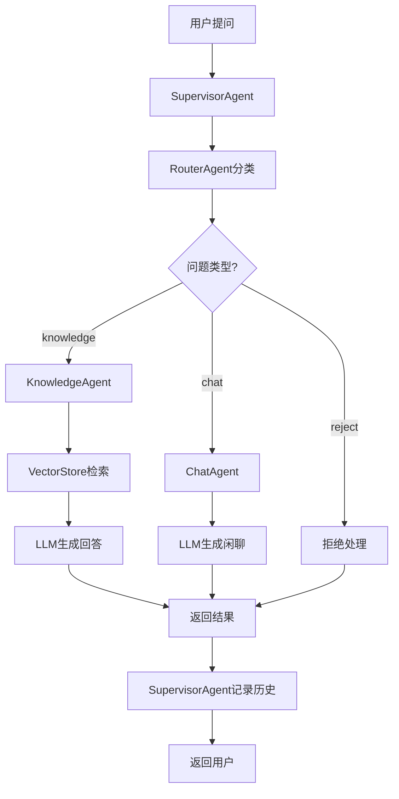

# GustoBot

<div align="center">

**基于Multi-Agent架构的智能菜谱客服系统**

[](https://www.python.org/)
[](https://fastapi.tiangolo.com/)
[](https://reactjs.org/)
[](LICENSE)

菜谱智能客服 · GustoBot

[特性](#特性) • [快速开始](#快速开始) • [架构](#技术架构) • [API文档](#api接口) • [贡献](#贡献)

</div>

---

## 📖 项目简介

GustoBot是一个企业级智能菜谱客服系统，采用**Multi-Agent**架构设计，能够智能处理用户关于菜谱、烹饪和食材的各类咨询。项目通过RAG（Retrieval Augmented Generation）技术，结合向量数据库实现精准的知识检索，有效解决了大模型在垂直领域应用中的常见痛点。

### 核心优势

- 🎯 **智能路由** - 自动识别用户问题类型，精准分发到对应处理单元
- 📚 **RAG知识检索** - 基于ChromaDB向量数据库的语义搜索，检索准确率高
- 🛡️ **防幻觉机制** - 仅基于知识库内容作答，杜绝AI胡编乱造
- 🤖 **Multi-Agent协同** - 路由Agent、知识库Agent、聊天Agent分工明确、协同工作
- 💬 **会话管理** - 支持多轮对话和上下文记忆
- 🚀 **生产就绪** - 完整的测试、日志、监控和Docker部署方案

---

## ✨ 特性

### 业务功能

| 功能 | 描述 | 状态 |
|------|------|------|
| 智能问答 | 基于知识库回答烹饪相关问题 | ✅ |
| 菜谱推荐 | 根据食材、口味推荐菜谱 | ✅ |
| 烹饪指导 | 详细的步骤讲解和技巧分享 | ✅ |
| 闲聊交互 | 友好的对话体验 | ✅ |
| 多轮对话 | 上下文理解和记忆 | ✅ |
| 数据采集 | 智能爬虫自动采集菜谱数据 | ✅ |

### 技术特性

| 特性 | 技术栈 | 说明 |
|------|--------|------|
| 后端框架 | FastAPI | 高性能异步Web框架 |
| 前端框架 | React + Vite | 现代化前端技术栈 |
| 向量数据库 | Milvus | 企业级开源向量数据库 |
| 嵌入模型 | OpenAI Embedding | OpenAI text-embedding-3-small |
| Reranker | Cohere/Jina/Voyage/BGE | API-based多厂商精排服务 |
| LLM集成 | OpenAI / Anthropic | 支持多种大模型 |
| 容器化 | Docker + Docker Compose | 一键部署 |
| 测试框架 | Pytest | 完整的单元测试覆盖 |
| 智能爬虫 | httpx + Playwright | HTTP爬虫 + 浏览器自动化 |
| 反爬机制 | Proxy Pool + Random UA | 代理池 + 随机UA + 请求延迟 |

---

## 🚀 快速开始

### 前置要求

- **Python** 3.9+
- **Node.js** 16+
- **pip** / **npm**
- (可选) **Docker** & **Docker Compose**

### 安装步骤

#### 1. 克隆项目

```bash
git clone https://github.com/yourusername/GustoBot.git
cd GustoBot
```

#### 2. 配置环境变量

```bash
# 复制环境变量模板
cp .env.example .env

# 编辑 .env 文件，配置必要的参数
# 至少需要配置以下内容：
# - OPENAI_API_KEY 或 ANTHROPIC_API_KEY (LLM API密钥)
# - 其他配置可保持默认值
```

#### 3. 安装依赖

**方式一：使用Makefile（推荐）**
```bash
make install
```

**方式二：手动安装**
```bash
# Python依赖
pip install -r requirements.txt

# 前端依赖
cd web && npm install
```

#### 4. 初始化数据目录

```bash
make init-data
```

#### 5. 启动服务

**开发模式（推荐）**
```bash
# 同时启动服务端和Web端
make dev
```

**生产模式（Docker）**
```bash
docker-compose up -d
```

**分别启动**
```bash
# 终端1 - 启动服务端（端口8000）
make run-server

# 终端2 - 启动Web端（端口3000）
make run-web
```

#### 6. 访问应用

| 服务 | 地址 | 说明 |
|------|------|------|
| 前端界面 | http://localhost:3000 | Web聊天界面 |
| API文档 | http://localhost:8000/docs | Swagger交互式文档 |
| ReDoc文档 | http://localhost:8000/redoc | ReDoc风格文档 |
| 健康检查 | http://localhost:8000/health | 服务健康状态 |

---

## 🏗️ 技术架构

### 系统架构图

```
┌─────────────────────────────────────────────────────────────┐
│                        用户界面 (Web)                        │
│                   React + Vite + Axios                      │
└────────────────────────┬────────────────────────────────────┘
                         │ HTTP/REST API
┌────────────────────────▼────────────────────────────────────┐
│                   API网关层 (FastAPI)                        │
│  ┌─────────────────┐           ┌──────────────────────┐    │
│  │  Chat API       │           │  Knowledge API       │    │
│  │  /api/v1/chat   │           │  /api/v1/knowledge   │    │
│  └────────┬────────┘           └───────────┬──────────┘    │
└───────────┼────────────────────────────────┼────────────────┘
            │                                │
┌───────────▼────────────────────────────────▼────────────────┐
│              Multi-Agent 协调层 (SupervisorAgent)            │
│  ┌──────────────────────────────────────────────────────┐  │
│  │              RouterAgent (问题分类)                   │  │
│  │  ┌────────────┬────────────────┬──────────────────┐  │  │
│  │  │ knowledge  │      chat      │      reject      │  │  │
│  │  └─────┬──────┴───────┬────────┴─────┬────────────┘  │  │
│  └────────┼──────────────┼──────────────┼───────────────┘  │
│           │              │              │                  │
│  ┌────────▼────────┐ ┌──▼─────────┐ ┌──▼──────────────┐  │
│  │ KnowledgeAgent  │ │ ChatAgent  │ │  Reject Handler │  │
│  │  (RAG检索)      │ │  (闲聊)    │ │  (礼貌拒绝)     │  │
│  └────────┬────────┘ └────────────┘ └─────────────────┘  │
└───────────┼──────────────────────────────────────────────-┘
            │
┌───────────▼────────────────────────────────────────────────┐
│              知识库层 (KnowledgeService)                    │
│  ┌──────────────────────────────────────────────────────┐  │
│  │  1. OpenAI Embedding (向量生成)                       │  │
│  │  2. Milvus VectorStore (向量检索)                     │  │
│  │  3. Reranker (结果重排序)                             │  │
│  │  ┌──────────────────┐      ┌───────────────────────┐ │  │
│  │  │ OpenAI Embedding │  →   │  Milvus Search        │ │  │
│  │  │ (text-emb-3-sm)  │      │  (IVF_FLAT + IP)      │ │  │
│  │  └──────────────────┘      └───────────┬───────────┘ │  │
│  │                                        │               │  │
│  │                            ┌───────────▼───────────┐ │  │
│  │                            │  Reranker API        │ │  │
│  │                            │  (Cohere/Jina/...)   │ │  │
│  │                            └─────────────────────┘ │  │
│  └──────────────────────────────────────────────────────┘  │
└─────────────────────────────────────────────────────────────┘
            │
┌───────────▼────────────────────────────────────────────────┐
│                 持久化层 (Data Storage)                     │
│  ┌──────────────┐  ┌──────────────┐  ┌─────────────────┐  │
│  │   Milvus     │  │    Redis     │  │    SQLite       │  │
│  │  (向量存储)  │  │  (会话缓存)  │  │  (元数据存储)   │  │
│  └──────────────┘  └──────────────┘  └─────────────────┘  │
└─────────────────────────────────────────────────────────────┘
```

### Agent工作流程



### 目录结构

```
GustoBot/
├── app/                    # 服务端代码
│   ├── agents/               # Multi-Agent系统
│   │   ├── __init__.py       # Agent模块导出
│   │   ├── base_agent.py     # Agent基类，定义通用接口
│   │   ├── router_agent.py   # 路由Agent，问题分类
│   │   ├── knowledge_agent.py # 知识库Agent，RAG检索
│   │   ├── chat_agent.py     # 聊天Agent，闲聊处理
│   │   └── supervisor_agent.py # 监督Agent，协调流程
│   ├── api/                  # FastAPI接口层
│   │   ├── __init__.py
│   │   ├── chat.py           # 聊天相关API
│   │   └── knowledge.py      # 知识库管理API
│   ├── knowledge_base/       # 知识库模块
│   │   ├── __init__.py
│   │   ├── vector_store.py   # 向量数据库封装
│   │   └── knowledge_service.py # 知识库业务逻辑
│   ├── crawler/              # 🕷️ 爬虫模块(详见 docs/crawler_guide.md)
│   │   ├── __init__.py       # 模块导出
│   │   ├── base_crawler.py   # HTTP爬虫基类(httpx)
│   │   ├── browser_crawler.py # 浏览器爬虫基类(Playwright)
│   │   ├── proxy_pool.py     # 代理池管理(轮换+健康检查)
│   │   ├── wikipedia_crawler.py # Wikipedia爬虫实现
│   │   ├── recipe_crawler.py # 通用菜谱爬虫(Schema.org)
│   │   ├── recipe_browser_crawler.py # 浏览器菜谱爬虫示例
│   │   ├── data_validator.py # 数据验证与清洗(Pydantic)
│   │   ├── cli.py            # 命令行工具
│   │   ├── README.md         # 爬虫模块文档
│   │   └── proxies.txt.example # 代理配置示例
│   ├── models/               # 数据模型
│   ├── services/             # 业务服务
│   ├── utils/                # 工具函数
│   ├── config/               # 配置管理
│   │   ├── __init__.py
│   │   └── settings.py       # 配置类
│   └── main.py               # 应用入口
├── web/                      # Web前端
│   ├── src/
│   │   ├── components/       # React组件
│   │   │   ├── ChatInterface.jsx # 聊天界面
│   │   │   └── Message.jsx   # 消息组件
│   │   ├── services/         # API服务
│   │   │   └── api.js        # API客户端
│   │   ├── utils/            # 工具函数
│   │   ├── App.jsx           # 根组件
│   │   ├── App.css           # 样式
│   │   └── main.jsx          # 入口文件
│   ├── public/               # 静态资源
│   ├── index.html            # HTML模板
│   ├── package.json          # npm配置
│   └── vite.config.js        # Vite配置
├── tests/                    # 测试代码
│   ├── unit/                 # 单元测试
│   │   ├── test_agents.py    # Agent测试
│   │   └── test_knowledge_service.py # 服务测试
│   └── integration/          # 集成测试
├── data/                     # 数据目录（.gitignore）
│   └── chroma/              # 向量数据库持久化
├── docs/                     # 文档
├── .env.example              # 环境变量模板
├── .gitignore               # Git忽略规则
├── requirements.txt          # Python依赖
├── pyproject.toml           # 项目配置
├── Makefile                 # 开发命令
├── Dockerfile               # Docker镜像
├── docker-compose.yml       # Docker编排
├── CLAUDE.md                # AI助手架构文档
├── LICENSE                  # 开源协议
└── README.md                # 本文件
```

---

## 📚 API接口

### 聊天接口

#### 发送消息

```http
POST /api/v1/chat/
Content-Type: application/json

{
  "message": "怎么做红烧肉？",
  "session_id": "session_123",  // 可选
  "user_id": "user_456"          // 可选
}
```

**响应示例：**
```json
{
  "answer": "红烧肉的做法如下：\n1. 五花肉切块，焯水去血沫...",
  "session_id": "session_123",
  "type": "knowledge",
  "metadata": {
    "route": "knowledge",
    "confidence": 0.95,
    "sources": ["recipe_001"],
    "timestamp": "2025-01-01T12:00:00"
  }
}
```

### 知识库管理接口

#### 添加菜谱

```http
POST /api/v1/knowledge/recipes
Content-Type: application/json

{
  "name": "红烧肉",
  "category": "家常菜",
  "difficulty": "中等",
  "time": "1小时",
  "ingredients": ["五花肉500g", "冰糖30g", "生抽2勺"],
  "steps": [
    "五花肉切块，焯水",
    "炒糖色，加入五花肉上色",
    "加入调料，小火炖煮40分钟"
  ],
  "tips": "糖色不要炒过头，容易发苦"
}
```

#### 搜索知识库

```http
POST /api/v1/knowledge/search
Content-Type: application/json

{
  "query": "家常菜",
  "top_k": 5
}
```

#### 获取统计信息

```http
GET /api/v1/knowledge/stats
```

更多API详情请访问: http://localhost:8000/docs

---

## 🛠️ 开发指南

### 开发命令

```bash
# 安装所有依赖（Python + Node.js）
make install

# 开发模式运行（同时启动服务端和Web端）
make dev

# 单独运行服务端
make run-server

# 单独运行Web端
make run-web

# 运行测试
make test

# 代码检查和格式化
make lint
make format

# 清理临时文件
make clean

# Docker操作
make docker-build   # 构建镜像
make docker-up      # 启动容器
make docker-down    # 停止容器

# 查看帮助
make help
```

### LLM集成

项目已预留LLM接口，需要实现以下方法：

**1. RouterAgent - 问题分类** (`app/agents/router_agent.py`)
```python
async def _call_llm(self, system_prompt: str, user_message: str, context: Dict) -> Dict[str, Any]:
    """使用LLM进行问题分类"""
    # 实现OpenAI/Anthropic API调用
    pass
```

**2. KnowledgeAgent - RAG回答生成** (`app/agents/knowledge_agent.py`)
```python
async def _call_llm(self, system_prompt: str, user_message: str) -> str:
    """基于检索文档生成回答"""
    # 实现LLM回答生成
    pass
```

**3. ChatAgent - 闲聊回复** (`app/agents/chat_agent.py`)
```python
async def _call_llm(self, system_prompt: str, user_message: str, context: Dict) -> str:
    """生成闲聊回复"""
    # 实现LLM闲聊
    pass
```

**集成示例（OpenAI）：**
```python
from openai import AsyncOpenAI
from app.config import settings

async def _call_llm(self, system_prompt: str, user_message: str) -> str:
    client = AsyncOpenAI(api_key=settings.OPENAI_API_KEY)
    response = await client.chat.completions.create(
        model=settings.OPENAI_MODEL,
        messages=[
            {"role": "system", "content": system_prompt},
            {"role": "user", "content": user_message}
        ],
        temperature=0.7,
        max_tokens=1000
    )
    return response.choices[0].message.content
```

### 添加新Agent

1. 在 `app/agents/` 创建新Agent文件
2. 继承 `BaseAgent` 类
3. 实现 `async def process(input_data: Dict) -> Dict` 方法
4. 在 `app/agents/__init__.py` 中导出
5. 在 `SupervisorAgent` 中注册和路由

### 📥 数据导入

GustoBot提供多种数据导入方式，满足不同场景需求。

#### 方式一：使用智能爬虫自动采集 ⭐ 推荐

智能爬虫模块支持从各类网站自动采集菜谱数据，内置反爬虫机制。

**1. Wikipedia菜谱爬取**
```bash
# 基础用法
python -m app.crawler.cli wikipedia --query "川菜" "粤菜" --import-kb

# 指定数量和语言
python -m app.crawler.cli wikipedia \
  --query "中国菜" "西餐" \
  --language zh \
  --limit 20 \
  --import-kb
```

**2. 通用网站爬取（支持Schema.org）**
```bash
# 爬取指定URL
python -m app.crawler.cli urls \
  --urls "https://example.com/recipe1" "https://example.com/recipe2" \
  --import-kb

# 使用代理池
python -m app.crawler.cli urls \
  --urls "https://example.com/recipes" \
  --proxy proxies.txt \
  --output recipes.json \
  --import-kb
```

**3. 编写自定义爬虫（针对特定网站）**

使用`BrowserCrawler`基类创建自己的爬虫：

```python
from app.crawler.browser_crawler import BrowserCrawler
from lxml import etree

class MyRecipeSiteCrawler(BrowserCrawler):
    """自定义菜谱网站爬虫"""

    async def parse(self, html_content: str, url: str):
        tree = etree.HTML(html_content)
        return [{
            "name": tree.xpath('//h1[@class="title"]/text()')[0],
            "ingredients": tree.xpath('//div[@class="ingredients"]//li/text()'),
            "steps": tree.xpath('//div[@class="steps"]//p/text()'),
            "url": url,
            "source": "MyRecipeSite"
        }]

    async def run(self, urls):
        recipes = []
        for url in urls:
            html = await self.fetch_page(
                url,
                scroll_count=2,  # 滚动2次加载更多
                click_selectors=['//button[contains(text(), "展开")]']  # 点击展开
            )
            if html:
                recipes.extend(await self.parse(html, url))
        return recipes

# 使用爬虫
async def main():
    from app.crawler.proxy_pool import ProxyPool

    proxy_pool = ProxyPool.from_file("proxies.txt")
    crawler = MyRecipeSiteCrawler(proxy_pool=proxy_pool, headless=True)

    async with crawler:
        recipes = await crawler.run(["https://example.com/recipe1"])
        print(f"爬取了 {len(recipes)} 个菜谱")
```

> 📚 **详细文档**: [爬虫使用指南](docs/crawler_guide.md) | [爬虫示例](docs/crawler_examples.md) | [反爬虫最佳实践](docs/anti_scraping_guide.md)

#### 方式二：通过API导入
```bash
curl -X POST "http://localhost:8000/api/v1/knowledge/recipes" \
  -H "Content-Type: application/json" \
  -d @recipe.json
```

#### 方式三：编写Python脚本
```python
import asyncio
from app.knowledge_base import KnowledgeService

async def import_recipes():
    service = KnowledgeService()
    recipes = [
        {
            "id": "recipe_001",
            "name": "红烧肉",
            "category": "家常菜",
            # ... 更多字段
        }
    ]
    result = await service.add_recipes_batch(recipes)
    print(f"导入完成: {result}")

if __name__ == "__main__":
    asyncio.run(import_recipes())
```

---

## 🧪 测试

### 运行测试

```bash
# 运行所有测试
pytest tests/ -v

# 运行特定测试文件
pytest tests/unit/test_agents.py -v

# 运行特定测试函数
pytest tests/unit/test_agents.py::test_router_agent_initialization -v

# 生成覆盖率报告
pytest tests/ --cov=app --cov-report=html

# 查看HTML覆盖率报告
open htmlcov/index.html
```

### 测试结构

```
tests/
├── unit/                      # 单元测试
│   ├── test_agents.py        # Agent测试
│   ├── test_knowledge_service.py # 知识库服务测试
│   └── test_vector_store.py  # 向量存储测试
├── integration/               # 集成测试
│   ├── test_api.py           # API集成测试
│   └── test_e2e.py           # 端到端测试
└── conftest.py               # Pytest配置和fixtures
```

---

## 🐳 Docker部署

### 快速部署

```bash
# 构建并启动所有服务
docker-compose up -d

# 查看日志
docker-compose logs -f

# 停止服务
docker-compose down

# 重新构建
docker-compose up -d --build
```

### 服务说明

| 服务 | 端口 | 说明 |
|------|------|------|
| server | 8000 | FastAPI服务端 |
| web | 3000 | React前端 |
| redis | 6379 | 会话缓存 |
| milvus | 19530 | 向量数据库 |
| etcd | 2379 | Milvus元数据存储 |
| minio | 9000, 9001 | Milvus对象存储 |

---

## 📝 配置说明

### 环境变量

| 变量名 | 必填 | 默认值 | 说明 |
|--------|------|--------|------|
| `OPENAI_API_KEY` | 否 | - | OpenAI API密钥 |
| `ANTHROPIC_API_KEY` | 否 | - | Anthropic API密钥 |
| `OPENAI_MODEL` | 否 | gpt-4-turbo-preview | OpenAI模型 |
| `ANTHROPIC_MODEL` | 否 | claude-3-opus-20240229 | Anthropic模型 |
| `DEBUG` | 否 | True | 调试模式 |
| `HOST` | 否 | 0.0.0.0 | 服务监听地址 |
| `PORT` | 否 | 8000 | 服务端口 |
| `MILVUS_HOST` | 否 | localhost | Milvus服务器地址 |
| `MILVUS_PORT` | 否 | 19530 | Milvus端口 |
| `MILVUS_COLLECTION` | 否 | recipes | Milvus集合名称 |
| `EMBEDDING_MODEL` | 否 | text-embedding-3-small | OpenAI嵌入模型 |
| `EMBEDDING_DIMENSION` | 否 | 1536 | 嵌入向量维度 |
| `RERANKER_PROVIDER` | 否 | cohere | Reranker提供商(cohere/jina/voyage/bge) |
| `RERANKER_API_KEY` | 否* | - | Reranker API密钥 (使用reranker时必填) |
| `RERANKER_MODEL` | 否 | - | Reranker模型名称(留空使用默认) |
| `RERANKER_API_URL` | 否 | - | Reranker API地址(BGE提供商需要) |
| `RERANKER_TOP_K` | 否 | 5 | Reranker返回数量 |
| `KB_TOP_K` | 否 | 5 | 检索结果数量 |
| `KB_SIMILARITY_THRESHOLD` | 否 | 0.7 | 相似度阈值 |
| `REDIS_HOST` | 否 | localhost | Redis地址 |
| `REDIS_PORT` | 否 | 6379 | Redis端口 |
| `REDIS_URL` | 否 | redis://localhost:6379/0 | Redis连接URL |
| `REDIS_CACHE_EXPIRE` | 否 | 43200 | 语义缓存过期时间(秒) |
| `REDIS_CACHE_THRESHOLD` | 否 | 0.92 | 语义缓存命中相似度阈值 |
| `REDIS_CACHE_MAX_SIZE` | 否 | 1000 | 每个命名空间的最大缓存条数 |
| `CONVERSATION_HISTORY_TTL` | 否 | 259200 | 对话历史保留时间(秒) |
| `CONVERSATION_HISTORY_MAX_MESSAGES` | 否 | 200 | 每个会话保留的最大消息数 |
| `OLLAMA_BASE_URL` | 否 | http://localhost:11434 | Ollama服务地址 |
| `OLLAMA_EMBEDDING_MODEL` | 否 | nomic-embed-text | 语义缓存使用的Embedding模型 |

---

## 🤝 贡献

欢迎贡献代码、报告问题和提出建议！

### 贡献流程

1. Fork本仓库
2. 创建特性分支 (`git checkout -b feature/AmazingFeature`)
3. 提交更改 (`git commit -m 'Add some AmazingFeature'`)
4. 推送到分支 (`git push origin feature/AmazingFeature`)
5. 开启Pull Request

### 代码规范

- Python代码遵循 **PEP 8** 规范
- 使用 **Black** 进行代码格式化
- 使用 **Flake8** 进行代码检查
- 使用 **MyPy** 进行类型检查
- 前端代码遵循 **ESLint** 规范

### 提交规范

提交信息格式: `<type>(<scope>): <subject>`

类型(type):
- `feat`: 新功能
- `fix`: 修复bug
- `docs`: 文档更新
- `style`: 代码格式
- `refactor`: 重构
- `test`: 测试
- `chore`: 构建/工具

示例: `feat(agent): add new recipe recommendation agent`

---

## 📄 许可证

本项目采用 [Apache License 2.0](LICENSE) 许可证。

---

## 🙏 致谢

- [FastAPI](https://fastapi.tiangolo.com/) - 现代化的Python Web框架
- [LangChain](https://python.langchain.com/) - LLM应用开发框架
- [Milvus](https://milvus.io/) - 企业级开源向量数据库
- [Cohere Rerank](https://cohere.com/rerank) / [Jina AI](https://jina.ai/) / [Voyage AI](https://www.voyageai.com/) - 二阶段重排序API服务
- [React](https://react.dev/) - 用户界面库

---

## 📧 联系方式

- 项目主页: https://github.com/yourusername/GustoBot
- 问题反馈: https://github.com/yourusername/GustoBot/issues
- 邮箱: your.email@example.com

---

## 📊 项目状态

- ✅ 核心功能已完成
- ✅ API接口完整
- ✅ 前端界面可用
- ⏳ LLM集成待完善
- ⏳ 生产环境优化中
- ⏳ 文档持续完善中

---

<div align="center">

**GustoBot** - 让AI成为您的私人厨房助手 🍳

Made with ❤️ by GustoBot Team

[⬆ 回到顶部](#gustobot)

</div>
