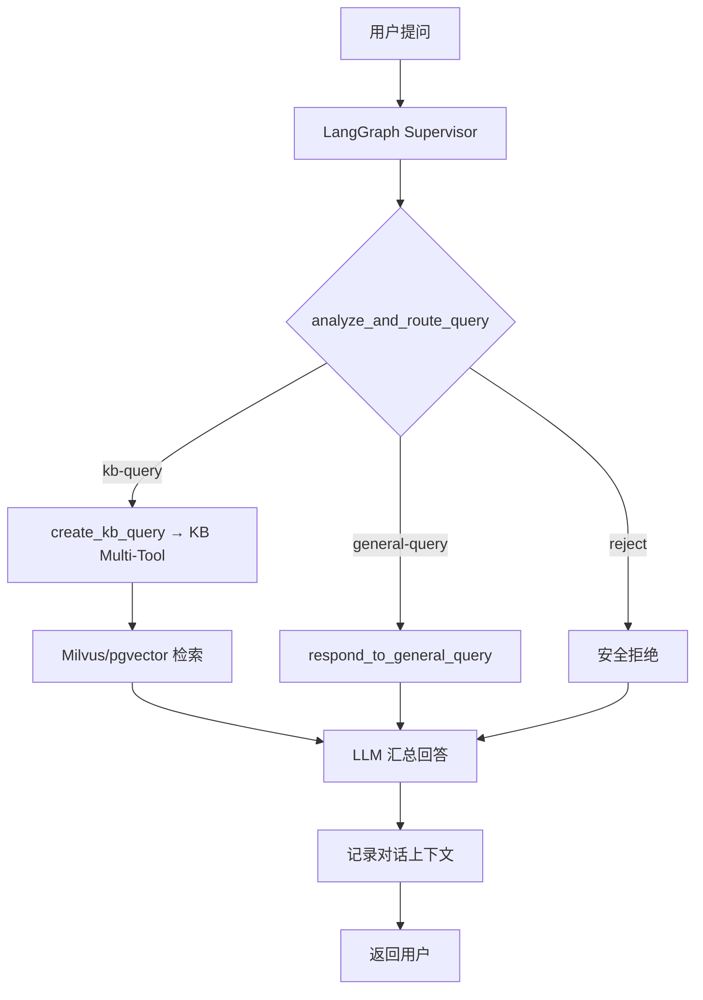

# GustoBot - 智能菜谱助手

<div align="center">
  <h2>🍳 基于 Multi-Agent 架构的智能菜谱助手系统</h2>

  [](https://python.org)
  [](https://reactjs.org)
  [](https://fastapi.tiangolo.com)
  [](LICENSE)
</div>

## 🎯 项目简介

GustoBot 是一个智能菜谱助手系统，采用 Multi-Agent 架构，能够自动理解用户意图并路由到合适的处理模块。系统支持知识库查询、图谱推理、统计分析等多种功能，为用户提供专业的菜谱咨询服务。

### 核心功能

- 🤖 **智能路由**：自动识别问题类型，路由到合适的处理模块
- 📚 **知识库查询**：支持历史文化、菜谱典故等知识查询
- 🕸️ **图谱推理**：基于 Neo4j 的菜谱关系推理
- 📊 **统计分析**：MySQL 数据库的统计和聚合查询
- 🖼️ **图片处理**：菜品图片分析和生成
- 📄 **文件处理**：支持 txt、excel 等文件上传分析
- 💬 **对话管理**：完整的对话历史和会话管理

### 技术架构

```
┌─────────────────────────────────────────────────────────────┐
│                        用户界面 (React)                         │
└─────────────────────────────────────────────────────────────┘
                              │
                              ▼
┌─────────────────────────────────────────────────────────────┐
│                      API Gateway (FastAPI)                      │
└─────────────────────────────────────────────────────────────┘
                              │
                              ▼
┌─────────────────────────────────────────────────────────────┐
│                   Multi-Agent Router (LangGraph)                 │
└─────────────────────────────────────────────────────────────┘
                              │
        ┌───────────────┬──────────────┬──────────────┬──────────────┐
        ▼               ▼              ▼              ▼              ▼
┌─────────────┐ ┌─────────────┐ ┌─────────────┐ ┌─────────────┐ ┌─────────────┐
│知识库查询   │ │图谱查询     │ │统计分析     │ │图片处理     │ │文件处理     │
│(Milvus+PG) │ │ (Neo4j)     │ │ (MySQL)     │ │ (Vision)    │ │ (Ingest)    │
└─────────────┘ └─────────────┘ └─────────────┘ └─────────────┘ └─────────────┘
```

### 技术栈

**后端**
- **框架**: FastAPI + Python 3.9+
- **Agent系统**: LangGraph
- **向量数据库**: Milvus
- **图数据库**: Neo4j
- **关系数据库**: MySQL
- **缓存**: Redis
- **LLM**: 支持千问、GPT、Claude等

**前端**
- **框架**: React 18
- **构建工具**: Vite
- **UI库**: Tailwind CSS
- **状态管理**: React Hooks
- **HTTP客户端**: Axios

---

## 🚀 快速开始

### 环境要求

- Python 3.10
- Node.js 16+
- Docker & Docker Compose（可选）

### 方式一：Docker Compose + 本地前端（推荐）

```bash
# 克隆项目
git clone <repository-url>
cd GustoBot

# 配置环境变量
cp .env.example .env
# 编辑 .env 文件，配置必要的 API 密钥

# 启动后端服务（Docker）
docker-compose up -d

# 安装并启动前端（本地）
cd web
npm install
npm run dev

# 访问应用
# 前端: http://localhost:3000
# 后端API: http://localhost:8000/docs
```

### 方式二：本地开发

```bash
# 1. 后端启动
python -m venv venv
source venv/bin/activate  # Windows: venv\Scripts\activate
pip install -r requirements.txt
python scripts/run.py start

# 2. 前端启动（新终端）
cd web
npm install
npm run dev
```

### 方式三：使用启动脚本

```bash
# Windows
scripts\start-dev.bat

# Linux/Mac
chmod +x scripts/start-dev.sh
./scripts/start-dev.sh
```

---

## 🏗️ 技术架构

### 系统架构图

```
┌─────────────────────────────────────────────────────────────┐
│                        用户界面 (Web)                        │
│                   React + Vite + Axios                      │
└────────────────────────┬────────────────────────────────────┘
                         │ HTTP/REST API
GustoBot 的核心调度由 LangGraph 构建的多节点工作流完成：

- **analyze_and_route_query**：LLM 驱动的路由节点，根据用户问题在 `kb-query`、`general-query`、`graphrag-query` 等路径之间做出判断。
- **create_kb_query**：触发 `create_kb_multi_tool_workflow`，按需调用 Milvus、PostgreSQL（pgvector）以及外部检索源，并融合多源答案。
- **respond_to_general_query / create_research_plan**：处理闲聊、常识问答或生成研究计划的 LangGraph 节点，依赖统一的对话历史。
- **safety_guardrails**：在 Guardrails 判定为越界时直接生成礼貌拒答。

知识检索链路依旧由 `KnowledgeService` 负责：

1. OpenAI 兼容 Embedding → 生成向量
2. Milvus VectorStore → 语义检索
3. 可选 Reranker → 结果精排
4. PostgreSQL（pgvector）→ 结构化 Excel 数据查询

底层持久化仍包括 Milvus、Redis、SQLite 等组件，对话和中间态统一写入 LangGraph 的检查点存储。

### Agent工作流程



### 目录结构

```
GustoBot/
├── gustobot/                    # 服务端代码
│   ├── agents/               # LangGraph 多节点系统
│   │   ├── __init__.py
│   │   ├── lg_builder.py     # LangGraph Supervisor & Router 定义
│   │   ├── lg_states.py      # 状态模型与类型
│   │   ├── lg_prompts.py     # Prompt 模板
│   │   ├── kb_tools/         # 知识库多工具节点
│   │   ├── kg_sub_graph/     # Agentic RAG / 多工具工作流
│   │   ├── text2sql/         # 结构化查询节点
│   │   ├── utils.py          # 辅助函数
│   │   └── main.py           # CLI 入口
│   ├── api/                  # FastAPI接口层
│   │   ├── __init__.py
│   │   ├── chat.py           # 聊天相关API
│   │   └── knowledge.py      # 知识库管理API
│   ├── knowledge_base/       # 知识库模块
│   │   ├── __init__.py
│   │   ├── vector_store.py   # 向量数据库封装
│   │   └── knowledge_service.py # 知识库业务逻辑
│   ├── crawler/              # 🕷️ 爬虫模块(详见 docs/crawler_guide.md)
│   │   ├── __init__.py       # 模块导出
│   │   ├── base_crawler.py   # HTTP爬虫基类(httpx)
│   │   ├── browser_crawler.py # 浏览器爬虫基类(Playwright)
│   │   ├── proxy_pool.py     # 代理池管理(轮换+健康检查)
│   │   ├── wikipedia_crawler.py # Wikipedia爬虫实现
│   │   └── proxies.txt.example # 代理配置示例
│   ├── domain/               # 领域模型聚合（兼容层）
│   ├── application/          # 应用层：Agents / Services / Prompts
│   ├── infrastructure/       # 基础设施：Core / Knowledge / Persistence / Tools
│   ├── interfaces/           # 接口适配层：HTTP API + Schemas
│   ├── config/               # 配置管理
│   └── main.py               # FastAPI 入口
├── web/                      # Web前端 (React + Vite)
├── tests/                    # 自动化测试
├── data/                     # 业务数据（.gitignore）
├── docs/                     # 文档
├── scripts/                  # 脚本工具
├── .env.example              # 环境变量模板
├── requirements.txt          # Python依赖
├── pyproject.toml            # 项目配置
├── Makefile                  # 开发命令
├── Dockerfile                # Docker镜像
├── docker-compose.yml        # Docker编排
├── CLAUDE.md                 # AI助手架构文档
├── LICENSE                   # 开源协议
└── README.md                 # 本文件
```

---

## 📚 API接口

### 聊天接口

#### 发送消息

```http
POST /api/v1/chat/
Content-Type: application/json

{
  "message": "怎么做红烧肉？",
  "session_id": "session_123",  // 可选
  "user_id": "user_456"          // 可选
}
```

**响应示例：**
```json
{
  "answer": "红烧肉的做法如下：\n1. 五花肉切块，焯水去血沫...",
  "session_id": "session_123",
  "type": "knowledge",
  "metadata": {
    "route": "knowledge",
    "confidence": 0.95,
    "sources": ["recipe_001"],
    "timestamp": "2025-01-01T12:00:00"
  }
}
```

### 知识库管理接口

#### 添加菜谱

```http
POST /api/v1/knowledge/recipes
Content-Type: application/json

{
  "name": "红烧肉",
  "category": "家常菜",
  "difficulty": "中等",
  "time": "1小时",
  "ingredients": ["五花肉500g", "冰糖30g", "生抽2勺"],
  "steps": [
    "五花肉切块，焯水",
    "炒糖色，加入五花肉上色",
    "加入调料，小火炖煮40分钟"
  ],
  "tips": "糖色不要炒过头，容易发苦"
}
```

#### 搜索知识库

```http
POST /api/v1/knowledge/search
Content-Type: application/json

{
  "query": "家常菜",
  "top_k": 5
}
```

#### 获取统计信息

```http
GET /api/v1/knowledge/stats
```

更多API详情请访问: http://localhost:8000/docs

---

## 🛠️ 开发指南

### 开发命令

```bash
# 安装所有依赖（Python + Node.js）
make install

# 启动后端服务（Docker）
make docker-up      # 启动所有后端服务

# 单独运行Web端（本地开发）
cd web && npm run dev

# 运行测试
make test

# 代码检查和格式化
make lint
make format

# 清理临时文件
make clean

# Docker操作
make docker-build   # 构建镜像
make docker-up      # 启动所有后端服务
make docker-down    # 停止所有服务

# 查看帮助
make help
```

### LLM集成

所有 LLM 相关逻辑集中在 `gustobot/application/agents/lg_builder.py` 及 `kg_sub_graph/agentic_rag_agents` 目录中的 LangGraph 节点：

- `analyze_and_route_query`、`respond_to_general_query` 等节点通过 `ChatOpenAI`（或兼容接口）完成分类、闲聊与总结。
- `create_kb_query` 会调用 `create_kb_multi_tool_workflow`，根据路由结果组合 Milvus、PostgreSQL（pgvector）及可选的外部检索。

要更换模型或服务商，只需在 `.env` 或 `gustobot/config/settings.py` 中调整以下变量：

- `OPENAI_API_KEY`、`OPENAI_MODEL`、`OPENAI_API_BASE`
- `EMBEDDING_API_KEY`、`EMBEDDING_MODEL`

若需要自定义 Prompt 或替换不同 LLM，可直接修改 `lg_builder.py` 中各节点的 Prompt 定义，或在 `create_kb_multi_tool_workflow` 里替换相应的 LangGraph 组件。

### 📥 数据导入

GustoBot提供多种数据导入方式，满足不同场景需求。

#### 方式一：使用智能爬虫自动采集 ⭐ 推荐

智能爬虫模块支持从各类网站自动采集菜谱数据，内置反爬虫机制。

**1. Wikipedia菜谱爬取**
```bash
# 基础用法
python -m gustobot.crawler.cli wikipedia --query "川菜" "粤菜" --import-kb

# 指定数量和语言
python -m gustobot.crawler.cli wikipedia \
  --query "中国菜" "西餐" \
  --language zh \
  --limit 20 \
  --import-kb
```

**2. 通用网站爬取（支持Schema.org）**
```bash
# 爬取指定URL
python -m gustobot.crawler.cli urls \
  --urls "https://example.com/recipe1" "https://example.com/recipe2" \
  --import-kb

# 使用代理池
python -m gustobot.crawler.cli urls \
  --urls "https://example.com/recipes" \
  --proxy proxies.txt \
  --output recipes.json \
  --import-kb
```

**3. 编写自定义爬虫（针对特定网站）**

使用`BrowserCrawler`基类创建自己的爬虫：

```python
from gustobot.crawler.browser_crawler import BrowserCrawler
from lxml import etree

class MyRecipeSiteCrawler(BrowserCrawler):
    """自定义菜谱网站爬虫"""

    async def parse(self, html_content: str, url: str):
        tree = etree.HTML(html_content)
        return [{
            "name": tree.xpath('//h1[@class="title"]/text()')[0],
            "ingredients": tree.xpath('//div[@class="ingredients"]//li/text()'),
            "steps": tree.xpath('//div[@class="steps"]//p/text()'),
            "url": url,
            "source": "MyRecipeSite"
        }]

    async def run(self, urls):
        recipes = []
        for url in urls:
            html = await self.fetch_page(
                url,
                scroll_count=2,  # 滚动2次加载更多
                click_selectors=['//button[contains(text(), "展开")]']  # 点击展开
            )
            if html:
                recipes.extend(await self.parse(html, url))
        return recipes

# 使用爬虫
async def main():
    from gustobot.crawler.proxy_pool import ProxyPool

    proxy_pool = ProxyPool.from_file("proxies.txt")
    crawler = MyRecipeSiteCrawler(proxy_pool=proxy_pool, headless=True)

    async with crawler:
        recipes = await crawler.run(["https://example.com/recipe1"])
        print(f"爬取了 {len(recipes)} 个菜谱")
```

> 📚 **详细文档**: [爬虫使用指南](docs/crawler_guide.md) | [爬虫示例](docs/crawler_examples.md) | [反爬虫最佳实践](docs/anti_scraping_guide.md)

#### 方式二：通过API导入
```bash
curl -X POST "http://localhost:8000/api/v1/knowledge/recipes" \
  -H "Content-Type: application/json" \
  -d @recipe.json
```

#### 方式三：编写Python脚本
```python
import asyncio
from gustobot.infrastructure.knowledge import KnowledgeService

async def import_recipes():
    service = KnowledgeService()
    recipes = [
        {
            "id": "recipe_001",
            "name": "红烧肉",
            "category": "家常菜",
            # ... 更多字段
        }
    ]
    result = await service.add_recipes_batch(recipes)
    print(f"导入完成: {result}")

if __name__ == "__main__":
    asyncio.run(import_recipes())
```

---

## 🧪 测试

### 运行测试

```bash
# 运行所有测试
pytest tests/ -v

# 运行特定测试文件
pytest tests/test_agents_comprehensive.py -v

# 运行特定测试函数
pytest tests/test_heuristic_router.py::test_router_routes_to_kb_query -v

# 生成覆盖率报告
pytest tests/ --cov=app --cov-report=html

# 查看HTML覆盖率报告
open htmlcov/index.html
```

### 测试结构

```
tests/
├── unit/                      # 单元测试
│   ├── test_knowledge_service.py # 知识库服务测试
│   └── test_vector_store.py  # 向量存储测试
├── test_agents_comprehensive.py  # 多Agent路由与执行测试
├── test_graph_query_simple.py    # Neo4j 简化查询脚本
├── test_graph_query_tools.py     # 图查询工具链测试
├── test_graphrag_tools.py        # GraphRAG 工具链测试
├── test_heuristic_router.py      # 路由提示词回归
├── test_lightrag_node.py         # LightRAG 工作流验证
├── test_new_architecture.py      # LangGraph 架构验证
└── test_qa_real_questions.py     # 真实问答脚本
```

---

## 🐳 Docker部署

### 快速部署

```bash
# 构建并启动所有服务
docker-compose up -d

# 查看日志
docker-compose logs -f

# 停止服务
docker-compose down

# 重新构建
docker-compose up -d --build
```

### 服务说明

| 服务 | 端口 | 说明 |
|------|------|------|
| server | 8000 | FastAPI服务端 |
| web | 3000 | React前端 |
| redis | 6379 | 会话缓存 |
| milvus | 19530 | 向量数据库 |
| etcd | 2379 | Milvus元数据存储 |
| minio | 9000, 9001 | Milvus对象存储 |

---

## 📝 配置说明

### 环境变量

| 变量名 | 必填 | 默认值 | 说明 |
|--------|------|--------|------|
| `OPENAI_API_KEY` | 否 | - | OpenAI API密钥 |
| `ANTHROPIC_API_KEY` | 否 | - | Anthropic API密钥 |
| `OPENAI_MODEL` | 否 | gpt-4-turbo-preview | OpenAI模型 |
| `ANTHROPIC_MODEL` | 否 | claude-3-opus-20240229 | Anthropic模型 |
| `DEBUG` | 否 | True | 调试模式 |
| `HOST` | 否 | 0.0.0.0 | 服务监听地址 |
| `PORT` | 否 | 8000 | 服务端口 |
| `MILVUS_HOST` | 否 | localhost | Milvus服务器地址 |
| `MILVUS_PORT` | 否 | 19530 | Milvus端口 |
| `MILVUS_COLLECTION` | 否 | recipes | Milvus集合名称 |
| `EMBEDDING_MODEL` | 否 | text-embedding-3-small | OpenAI嵌入模型 |
| `EMBEDDING_DIMENSION` | 否 | 1536 | 嵌入向量维度 |
| `RERANKER_PROVIDER` | 否 | cohere | Reranker提供商(cohere/jina/voyage/bge) |
| `RERANKER_API_KEY` | 否* | - | Reranker API密钥 (使用reranker时必填) |
| `RERANKER_MODEL` | 否 | - | Reranker模型名称(留空使用默认) |
| `RERANKER_API_URL` | 否 | - | Reranker API地址(BGE提供商需要) |
| `RERANKER_TOP_K` | 否 | 5 | Reranker返回数量 |
| `KB_TOP_K` | 否 | 5 | 检索结果数量 |
| `KB_SIMILARITY_THRESHOLD` | 否 | 0.7 | 相似度阈值 |
| `REDIS_HOST` | 否 | localhost | Redis地址 |
| `REDIS_PORT` | 否 | 6379 | Redis端口 |
| `REDIS_URL` | 否 | redis://localhost:6379/0 | Redis连接URL |
| `REDIS_CACHE_EXPIRE` | 否 | 43200 | 语义缓存过期时间(秒) |
| `REDIS_CACHE_THRESHOLD` | 否 | 0.92 | 语义缓存命中相似度阈值 |
| `REDIS_CACHE_MAX_SIZE` | 否 | 1000 | 每个命名空间的最大缓存条数 |
| `CONVERSATION_HISTORY_TTL` | 否 | 259200 | 对话历史保留时间(秒) |
| `CONVERSATION_HISTORY_MAX_MESSAGES` | 否 | 200 | 每个会话保留的最大消息数 |
| `OLLAMA_BASE_URL` | 否 | http://localhost:11434 | Ollama服务地址 |
| `OLLAMA_EMBEDDING_MODEL` | 否 | nomic-embed-text | 语义缓存使用的Embedding模型 |

---

## 🤝 贡献

欢迎贡献代码、报告问题和提出建议！

### 贡献流程

1. Fork本仓库
2. 创建特性分支 (`git checkout -b feature/AmazingFeature`)
3. 提交更改 (`git commit -m 'Add some AmazingFeature'`)
4. 推送到分支 (`git push origin feature/AmazingFeature`)
5. 开启Pull Request

### 代码规范

- Python代码遵循 **PEP 8** 规范
- 使用 **Black** 进行代码格式化
- 使用 **Flake8** 进行代码检查
- 使用 **MyPy** 进行类型检查
- 前端代码遵循 **ESLint** 规范

### 提交规范

提交信息格式: `<type>(<scope>): <subject>`

类型(type):
- `feat`: 新功能
- `fix`: 修复bug
- `docs`: 文档更新
- `style`: 代码格式
- `refactor`: 重构
- `test`: 测试
- `chore`: 构建/工具

示例: `feat(agent): add new recipe recommendation agent`

---

## 📄 许可证

本项目采用 [Apache License 2.0](LICENSE) 许可证。

---

## 🙏 致谢

- [FastAPI](https://fastapi.tiangolo.com/) - 现代化的Python Web框架
- [LangChain](https://python.langchain.com/) - LLM应用开发框架
- [Milvus](https://milvus.io/) - 企业级开源向量数据库
- [Cohere Rerank](https://cohere.com/rerank) / [Jina AI](https://jina.ai/) / [Voyage AI](https://www.voyageai.com/) - 二阶段重排序API服务
- [React](https://react.dev/) - 用户界面库

---

## 📧 联系方式

- 项目主页: https://github.com/yourusername/GustoBot
- 问题反馈: https://github.com/yourusername/GustoBot/issues
- 邮箱: your.email@example.com

---

## 📊 项目状态

- ✅ 核心功能已完成
- ✅ API接口完整
- ✅ 前端界面可用
- ⏳ LLM集成待完善
- ⏳ 生产环境优化中
- ⏳ 文档持续完善中

---

<div align="center">

**GustoBot** - 让AI成为您的私人厨房助手 🍳

Made with ❤️ by GustoBot Team

[⬆ 回到顶部](#gustobot)

</div>
