# GustoBot - 智能菜谱助手

<div align="center">
  <h2>🍳 基于 Multi-Agent 架构的智能菜谱助手系统</h2>

  
  
  
  
  
  
  
  
  
  
</div>

## 🎯 项目简介

中华菜谱作为世界饮食文化的瑰宝之一，拥有深厚的历史底蕴与丰富的知识体系。从八大菜系的地域特色，到食材搭配的营养学原理，再到烹饪技法的代际传承，菜谱知识既具有高度结构化的特点（如食材用量、烹饪步骤），又包含大量非结构化的文化典故与经验性描述。这种复杂性使得传统的关键词搜索难以满足用户对菜谱知识的深度探索需求。

随着大语言模型（LLM）与知识增强技术的快速发展，将菜谱知识构建为一个**多模态、结构化、可交互的 AI 系统**成为可能。本项目以中华菜谱数据为基础，构建出覆盖菜谱名称、食材、烹饪步骤、营养成分、菜系流派、历史典故等元素的**多层次知识图谱**，并结合大模型的理解与生成能力，打造了一个**专注于菜谱领域的智能对话助手**——「GustoBot」。

在技术架构层面，我们融合了 **LangGraph 多智能体编排**、**GraphRAG 图谱检索增强**、**Text2SQL 结构化查询**、以及**多源知识融合**技术，使用户不仅可以通过自然语言提问获得精确答案（如"宫保鸡丁怎么做？"、"川菜有多少道菜？"），还能探索菜谱的历史文化背景（如"宫保鸡丁的典故"）、获取营养建议、甚至生成菜品图片。

### 🌟 核心价值

本项目致力于打造一个**可迁移、可扩展、面向垂直领域的智能助手模板系统**。通过清晰的三层架构设计（主路由层 → 多工具子图层 → 原子工具层），你可以轻松将其迁移至其他垂直领域（如「宝可梦百科」、「中医药典」、「法律咨询」、「政务服务」等）中打造专域智能助手。仅需更换知识源与图谱结构，即可实现：

- 🧠 **智能意图理解**：自动识别问题类型，路由到最优处理模块
- 📊 **多工具协作**：动态组合 Neo4j 图谱查询、MySQL 统计分析、向量检索、外部搜索等多种工具
- 🔄 **PostgreSQL 优先兜底策略**：结构化数据优先 → 向量兜底 → 外部搜索，确保答案质量
- 🎨 **多模态交互**：支持文本问答、图片识别/生成、文件解析等多种交互方式
- 📚 **知识来源可追溯**：每个答案都标注来源，支持多源信息融合
- 🛡️ **安全防护机制**：Guardrails 层确保问题在服务范围内，拒绝越界查询

### 🚀 核心功能

| 功能模块 | 说明 | 技术实现 |
|---------|------|---------|
| 🤖 **智能路由** | 自动识别问题类型，路由到合适的处理模块 | 启发式路由 + LLM 结构化输出 |
| 📚 **知识库查询** | 支持历史文化、菜谱典故等知识查询 | Milvus + PostgreSQL pgvector + Reranker |
| 🕸️ **图谱推理** | 基于 Neo4j 的菜谱关系推理 | Cypher 动态生成 + Few-shot 示例检索 |
| 📊 **统计分析** | MySQL 数据库的统计和聚合查询 | Text2SQL + LLM 自然语言转换 |
| 🧩 **社区检索** | Microsoft GraphRAG 社区摘要检索 | LightRAG Global/Local/Hybrid Search |
| 🖼️ **图片处理** | 菜品图片识别与生成 | Vision Model + CogView-4 |
| 📄 **文件处理** | 支持 Excel、TXT、Markdown 等文件上传分析 | Ingest Service + Knowledge Service |
| 💬 **对话管理** | 完整的对话历史和会话管理 | LangGraph Checkpointer + Redis |

### 🏗️ 技术架构

```
┌──────────────────────────────────────────────────────────────┐
│                     🌐 用户界面 (React 18)                       │
│                React + Vite + Tailwind CSS                    │
└────────────────────────┬─────────────────────────────────────┘
                         │ HTTP/REST API
                         ▼
┌──────────────────────────────────────────────────────────────┐
│                   ⚡ API Gateway (FastAPI)                     │
│              异步路由 + WebSocket + 流式响应                      │
└────────────────────────┬─────────────────────────────────────┘
                         │
                         ▼
┌──────────────────────────────────────────────────────────────┐
│              🎯 Multi-Agent Router (LangGraph)                │
│         analyze_and_route_query → 7个专门处理通道               │
└────────────────────────┬─────────────────────────────────────┘
                         │
        ┌────────────────┼────────────────┬────────────────┐
        ▼                ▼                ▼                ▼
┌──────────────┐ ┌──────────────┐ ┌──────────────┐ ┌──────────────┐
│ 📚 知识库查询 │ │ 🕸️ 图谱查询   │ │ 📊 统计分析   │ │ 🖼️ 图片处理   │
│   多工具子图  │ │   多工具子图  │ │   Text2SQL   │ │ Vision+DALL·E│
└──────┬───────┘ └──────┬───────┘ └──────┬───────┘ └──────────────┘
       │                │                │
       ▼                ▼                ▼
┌──────────────┐ ┌──────────────┐ ┌──────────────┐
│ PostgreSQL   │ │   Neo4j      │ │    MySQL     │
│   pgvector   │ │  GraphDB     │ │  RelationalDB│
└──────────────┘ └──────────────┘ └──────────────┘
       │
       ▼
┌──────────────┐
│   Milvus     │
│  VectorDB    │
└──────────────┘
```

### ⚙️ 技术栈

**🔧 后端技术**
- **框架**: FastAPI + Python 3.11
- **Agent 系统**: LangGraph (多智能体编排)
- **图数据库**: Neo4j 4.4 (知识图谱存储)
- **向量数据库**: Milvus 2.3 (语义检索)
- **结构化向量**: PostgreSQL pgvector (结构化数据检索)
- **关系数据库**: MySQL 8.0 (统计查询)
- **缓存**: Redis (会话管理 + 语义缓存)
- **LLM**: 支持 OpenAI / 千问 / Claude / DeepSeek 等

**🎨 前端技术**
- **框架**: React 18 + TypeScript
- **构建工具**: Vite 4
- **UI 库**: Tailwind CSS + Ant Design
- **状态管理**: React Hooks + Context API
- **HTTP 客户端**: Axios
- **实时通信**: WebSocket (流式响应)

**🔍 检索增强技术**
- **GraphRAG**: Microsoft LightRAG (社区检索)
- **Reranker**: Cohere / Jina / Voyage / BGE (重排序)
- **Embedding**: OpenAI text-embedding-3-small / BGE
- **Text2SQL**: LLM 驱动的自然语言转 SQL

**🎯 多模态能力**
- **图片理解**: Vision Model (GLM-4V / GPT-4V)
- **图片生成**: CogView-4 / DALL·E 3
- **文件解析**: Ingest Service (Excel/PDF/Markdown)

---

## 🚀 快速开始

### 环境要求

- Python 3.10
- Node.js 16+
- Docker & Docker Compose（可选）

### 方式一：Docker Compose + 本地前端（推荐）

```bash
# 克隆项目
git clone <repository-url>
cd GustoBot

# 配置环境变量
cp .env.example .env
# 编辑 .env 文件，配置必要的 API 密钥

# 启动后端服务（Docker）
docker-compose up -d

# 安装并启动前端（本地）
cd web
npm install
npm run dev

# 访问应用
# 前端: http://localhost:3000
# 后端API: http://localhost:8000/docs
```
 
---

## 🏗️ 技术架构

### 系统架构图

```
┌─────────────────────────────────────────────────────────────┐
│                        用户界面 (Web)                        │
│                   React + Vite + Axios                      │
└────────────────────────┬────────────────────────────────────┘
                         │ HTTP/REST API
GustoBot 的核心调度由 LangGraph 构建的多节点工作流完成：

- **analyze_and_route_query**：LLM 驱动的路由节点，根据用户问题在 `kb-query`、`general-query`、`graphrag-query` 等路径之间做出判断。
- **create_kb_query**：触发 `create_kb_multi_tool_workflow`，按需调用 Milvus、PostgreSQL（pgvector）以及外部检索源，并融合多源答案。
- **respond_to_general_query / create_research_plan**：处理闲聊、常识问答或生成研究计划的 LangGraph 节点，依赖统一的对话历史。
- **safety_guardrails**：在 Guardrails 判定为越界时直接生成礼貌拒答。

知识检索链路依旧由 `KnowledgeService` 负责：

1. OpenAI 兼容 Embedding → 生成向量
2. Milvus VectorStore → 语义检索
3. 可选 Reranker → 结果精排
4. PostgreSQL（pgvector）→ 结构化 Excel 数据查询

底层持久化仍包括 Milvus、Redis、SQLite 等组件，对话和中间态统一写入 LangGraph 的检查点存储。

### Agent工作流程 - 超级完整架构图

#### 完整三层架构流程图（包含所有子图详细节点）

```mermaid
graph TB
    %% ========== 用户入口 ==========
    Start([👤 用户提问]) --> MainGraph[🎯 LangGraph 主工作流]

    %% ========== 第一层：主路由层 ==========
    MainGraph --> RouterNode["🧭 analyze_and_route_query<br/>━━━━━━━━━━━━━━━━<br/>📋 系统提示: ROUTER_SYSTEM_PROMPT<br/>🔍 启发式路由 + LLM 路由双保险<br/>📊 结构化输出: Router Pydantic Model"]

    RouterNode --> RouteDecision{"🚦 route_query<br/>条件路由"}

    RouteDecision -->|general-query| GeneralNode["💬 respond_to_general_query<br/>━━━━━━━━━━━━━━━━<br/>📋 GENERAL_QUERY_SYSTEM_PROMPT<br/>💡 纯 LLM 生成回复<br/>不调用任何外部工具"]

    RouteDecision -->|additional-query| AdditionalNode["❓ get_additional_info<br/>━━━━━━━━━━━━━━━━<br/>📋 GET_ADDITIONAL_SYSTEM_PROMPT<br/>🛡️ Guardrails 安全检查<br/>引导用户提供更多信息"]

    RouteDecision -->|graphrag-query<br/>text2sql-query| ResearchNode["🔬 create_research_plan<br/>━━━━━━━━━━━━━━━━<br/>调用 GraphRAG 多工具子图"]

    RouteDecision -->|kb-query| KBNode["📚 create_kb_query<br/>━━━━━━━━━━━━━━━━<br/>调用知识库多工具子图"]

    RouteDecision -->|image-query| ImageNode["🖼️ create_image_query<br/>━━━━━━━━━━━━━━━━<br/>📸 图片识别: Vision Model<br/>🎨 图片生成: CogView-4"]

    RouteDecision -->|file-query| FileNode["📄 create_file_query<br/>━━━━━━━━━━━━━━━━<br/>📊 Excel: 外部 Ingest Service<br/>📝 TXT/MD/JSON: KnowledgeService"]

    %% ========== 第二层A：GraphRAG 多工具子图 ==========
    ResearchNode --> SubGraph1["╔═══════════════════════════════════════╗<br/>║  🔷 GraphRAG 多工具子图 (create_multi_tool_workflow)  ║<br/>╚═══════════════════════════════════════╝"]

    SubGraph1 --> SG1_Guardrails["🛡️ Guardrails Node<br/>━━━━━━━━━━━━━━━━<br/>📋 GUARDRAILS_SYSTEM_PROMPT<br/>📊 检查问题范围<br/>🔍 图谱 Schema 验证"]

    SG1_Guardrails --> SG1_GuardCheck{"✅ 通过检查?"}
    SG1_GuardCheck -->|拒绝 end| SG1_FinalAnswer_Reject["❌ 直接返回拒绝消息"]
    SG1_GuardCheck -->|通过 proceed| SG1_Planner["🧩 Planner Node<br/>━━━━━━━━━━━━━━━━<br/>📋 任务分解提示<br/>🎯 Map-Reduce 模式<br/>将复杂问题拆解为子任务"]

    SG1_Planner --> SG1_MapReduce["📊 map_reduce_planner_to_tool_selection<br/>━━━━━━━━━━━━━━━━<br/>条件边逻辑<br/>遍历每个子任务"]

    SG1_MapReduce --> SG1_ToolSelection["🛠️ Tool Selection Node<br/>━━━━━━━━━━━━━━━━<br/>📋 根据 tool_schemas 选择工具<br/>🤖 LLM structured output<br/>🔧 工具列表:<br/>  • cypher_query<br/>  • predefined_cypher<br/>  • microsoft_graphrag_query<br/>  • text2sql_query"]

    SG1_ToolSelection --> SG1_ToolDecision{"🎯 选择的工具?"}

    SG1_ToolDecision -->|cypher_query| SG1_Cypher["⚙️ Cypher Query Node<br/>━━━━━━━━━━━━━━━━<br/>📋 动态生成 Cypher<br/>🔍 BaseCypherExampleRetriever<br/>  检索 Few-shot 示例<br/>🧠 LLM 生成查询语句<br/>✅ Cypher 验证 (可选)<br/>🗄️ Neo4j 执行查询<br/>📊 返回图谱数据"]

    SG1_ToolDecision -->|predefined_cypher| SG1_Predefined["📋 Predefined Cypher Node<br/>━━━━━━━━━━━━━━━━<br/>📚 predefined_cypher_dict<br/>🔍 匹配预定义查询<br/>🗄️ Neo4j 直接执行<br/>⚡ 快速、准确"]

    SG1_ToolDecision -->|microsoft_graphrag_query| SG1_GraphRAG["🌐 Microsoft GraphRAG Node<br/>━━━━━━━━━━━━━━━━<br/>🔍 LightRAG 社区检索<br/>📊 Global Search (全局)<br/>📌 Local Search (局部)<br/>🧩 Hybrid Search (混合)<br/>💡 社区摘要 + 实体关系"]

    SG1_ToolDecision -->|text2sql_query| SG1_Text2SQL["🗃️ Text2SQL Query Node<br/>━━━━━━━━━━━━━━━━<br/>📋 自然语言转 SQL<br/>🧠 LLM 生成 SQL 语句<br/>🔍 支持统计、聚合、排名<br/>💾 MySQL 执行查询<br/>📊 返回结构化数据"]

    SG1_Cypher --> SG1_Summarize["📝 Summarize Node<br/>━━━━━━━━━━━━━━━━<br/>🔄 聚合所有工具结果<br/>📊 合并 data 字段<br/>🧠 LLM 初步整理"]
    SG1_Predefined --> SG1_Summarize
    SG1_GraphRAG --> SG1_Summarize
    SG1_Text2SQL --> SG1_Summarize

    SG1_Summarize --> SG1_FinalAnswer["✨ Final Answer Node<br/>━━━━━━━━━━━━━━━━<br/>📋 RAGSEARCH_SYSTEM_PROMPT<br/>🧠 LLM 生成最终回答<br/>📚 引用来源标注<br/>✅ 幻觉检查 (可选)"]

    SG1_FinalAnswer --> SG1_End["🎁 返回到主工作流<br/>answer 字段"]
    SG1_FinalAnswer_Reject --> SG1_End

    %% ========== 第二层B：知识库多工具子图 ==========
    KBNode --> SubGraph2["╔═══════════════════════════════════════╗<br/>║  🔷 知识库多工具子图 (create_kb_multi_tool_workflow)  ║<br/>╚═══════════════════════════════════════╝"]

    SubGraph2 --> SG2_Guardrails["🛡️ KB Guardrails Node<br/>━━━━━━━━━━━━━━━━<br/>📋 KBGuardrailsDecision<br/>🔍 scope_description 范围检查<br/>仅处理历史文化典故类问题"]

    SG2_Guardrails --> SG2_GuardCheck{"✅ 通过检查?"}
    SG2_GuardCheck -->|decision=end| SG2_Finalize_Reject["❌ 直接返回拒绝<br/>返回 summary"]
    SG2_GuardCheck -->|decision=proceed| SG2_Router["🧭 KB Router Node<br/>━━━━━━━━━━━━━━━━<br/>📋 KBRouteDecision<br/>🤖 LLM 路由决策<br/>📊 路由类型:<br/>  • local (本地检索)<br/>  • external (外部API)<br/>  • hybrid (混合)<br/>🔧 工具选择:<br/>  • postgres (优先)<br/>  • milvus (兜底)"]

    SG2_Router --> SG2_RouteCheck{"🚦 路由类型?"}

    SG2_RouteCheck -->|local/hybrid| SG2_LocalSearch["🔍 Local Search Node<br/>━━━━━━━━━━━━━━━━<br/>🎯 PostgreSQL 优先策略:<br/>━━━━━━━━━━━━━━━━<br/>1️⃣ 查询 PostgreSQL pgvector<br/>  • 结构化数据 (Excel 导入)<br/>  • 菜谱名称、菜系、枚举字段<br/>  • 快速、精准<br/>  • threshold 阈值过滤<br/>━━━━━━━━━━━━━━━━<br/>2️⃣ 如果 PG 有结果 ✅<br/>  → 直接使用，跳过 Milvus<br/>━━━━━━━━━━━━━━━━<br/>3️⃣ 如果 PG 无结果 ❌<br/>  → Milvus 向量库兜底<br/>  • 长文本故事、典故<br/>  • 语义相似度检索<br/>  • threshold 阈值过滤"]

    SG2_RouteCheck -->|external| SG2_ExternalSearch

    SG2_LocalSearch --> SG2_PG[("💾 PostgreSQL pgvector<br/>━━━━━━━━━━━━━━━━<br/>📊 结构化向量数据<br/>📈 快速精准查询<br/>🔢 similarity 相似度<br/>⚡ 第一优先级")]

    SG2_LocalSearch --> SG2_Milvus[("🗄️ Milvus 向量库<br/>━━━━━━━━━━━━━━━━<br/>📚 长文本语义检索<br/>📖 故事、典故内容<br/>🔢 similarity 相似度<br/>🛟 兜底策略")]

    SG2_PG --> SG2_Reranker{"🎯 Reranker 启用?"}
    SG2_Milvus --> SG2_Reranker

    SG2_Reranker -->|是| SG2_RerankProcess["🔄 Reranker 重排序<br/>━━━━━━━━━━━━━━━━<br/>🤖 Reranker API<br/>  • Cohere / Jina / Voyage / BGE<br/>━━━━━━━━━━━━━━━━<br/>📊 双重阈值过滤:<br/>  • similarity >= threshold<br/>  • rerank_score >= threshold<br/>━━━━━━━━━━━━━━━━<br/>🎯 提升结果质量"]

    SG2_Reranker -->|否| SG2_MergeResults["📦 合并结果"]
    SG2_RerankProcess --> SG2_MergeResults

    SG2_MergeResults --> SG2_ResultCheck{"📊 结果充足?"}
    SG2_ResultCheck -->|是| SG2_Finalize
    SG2_ResultCheck -->|否 且 hybrid| SG2_ExternalSearch["🌐 External Search Node<br/>━━━━━━━━━━━━━━━━<br/>🔗 external_search_url<br/>📡 调用外部检索 API<br/>🌍 互联网知识补充<br/>⏱️ timeout 超时控制"]

    SG2_ExternalSearch --> SG2_Finalize["✨ Finalize Node<br/>━━━━━━━━━━━━━━━━<br/>📋 final_prompt<br/>🧠 LLM 融合多源信息:<br/>  • Milvus 结果<br/>  • PostgreSQL 结果<br/>  • External 结果<br/>━━━━━━━━━━━━━━━━<br/>📚 格式化 context<br/>🔗 收集 sources<br/>✨ 生成最终回答"]

    SG2_Finalize --> SG2_End["🎁 返回到主工作流<br/>answer + sources 字段"]
    SG2_Finalize_Reject --> SG2_End

    %% ========== 汇总返回 ==========
    GeneralNode --> End([📤 返回用户])
    AdditionalNode --> End
    ImageNode --> End
    FileNode --> End
    SG1_End --> End
    SG2_End --> End

    %% ========== 样式定义 ==========
    classDef entryClass fill:#e3f2fd,stroke:#1565c0,stroke-width:3px,color:#000
    classDef routerClass fill:#fff9c4,stroke:#f57f17,stroke-width:2px,color:#000
    classDef nodeClass fill:#f3e5f5,stroke:#6a1b9a,stroke-width:2px,color:#000
    classDef subgraphClass fill:#ffe0b2,stroke:#e65100,stroke-width:3px,color:#000
    classDef toolClass fill:#e1bee7,stroke:#4a148c,stroke-width:2px,color:#000
    classDef dbClass fill:#c8e6c9,stroke:#2e7d32,stroke-width:2px,color:#000
    classDef llmClass fill:#ffcdd2,stroke:#c62828,stroke-width:2px,color:#000
    classDef decisionClass fill:#fff3e0,stroke:#ef6c00,stroke-width:2px,color:#000
    classDef endClass fill:#b2dfdb,stroke:#00695c,stroke-width:3px,color:#000

    class Start,MainGraph entryClass
    class RouterNode,SG2_Router routerClass
    class GeneralNode,AdditionalNode,ImageNode,FileNode nodeClass
    class SubGraph1,SubGraph2 subgraphClass
    class SG1_Cypher,SG1_Predefined,SG1_GraphRAG,SG1_Text2SQL,SG2_LocalSearch,SG2_ExternalSearch toolClass
    class SG2_PG,SG2_Milvus dbClass
    class SG1_Planner,SG1_ToolSelection,SG1_Summarize,SG1_FinalAnswer,SG2_Finalize,SG2_RerankProcess llmClass
    class RouteDecision,SG1_GuardCheck,SG1_ToolDecision,SG2_GuardCheck,SG2_RouteCheck,SG2_Reranker,SG2_ResultCheck decisionClass
    class End,SG1_End,SG2_End endClass
```



#### 🎯 核心流程说明

##### 第一层：主路由层 (lg_builder.py)

1. **analyze_and_route_query** - 意图识别路由节点
   - 使用 `ROUTER_SYSTEM_PROMPT` 引导 LLM 分类
   - 启发式路由 (`_heuristic_router`) + LLM 路由双保险
   - 输出 `Router` Pydantic 结构化模型
   - 支持 7 种查询类型

2. **route_query** - 条件路由决策
   - 根据 `router.type` 分发到不同处理节点
   - 检查 `config.image_path` / `config.file_path` 优先级

##### 第二层A：GraphRAG 多工具子图 (multi_tool.py - create_multi_tool_workflow)

**工作流**: `guardrails → planner → tool_selection → [工具并行执行] → summarize → final_answer`

1. **Guardrails Node** - 安全防护
   - 检查问题是否在菜谱服务范围内
   - 验证 Neo4j 图谱 Schema
   - 决策: `proceed` / `end`

2. **Planner Node** - 任务分解
   - Map-Reduce 模式
   - 将复杂问题拆解为多个子任务
   - 每个子任务独立处理

3. **Tool Selection Node** - 工具选择
   - 根据 `tool_schemas` 让 LLM 选择最优工具
   - 支持 4 个并行工具

4. **工具节点** (并行执行):
   - **Cypher Query**: 动态生成 Cypher → Neo4j 图谱查询
   - **Predefined Cypher**: 使用预定义查询模板
   - **Microsoft GraphRAG**: LightRAG 社区检索
   - **Text2SQL Query**: 自然语言转 SQL → MySQL 统计查询

5. **Summarize Node** - 结果聚合
   - 合并所有工具的返回数据
   - LLM 初步整理

6. **Final Answer Node** - 生成最终回答
   - 使用 `RAGSEARCH_SYSTEM_PROMPT`
   - 引用来源标注
   - 可选幻觉检查

##### 第二层B：知识库多工具子图 (multi_tool.py - create_kb_multi_tool_workflow)

**工作流**: `guardrails → kb_router → local_search → [reranker] → finalize`

1. **KB Guardrails Node** - 范围检查
   - 仅处理历史文化典故类问题
   - 拒绝烹饪步骤、食材搭配等

2. **KB Router Node** - 路由决策
   - LLM 决定路由类型: `local` / `external` / `hybrid`
   - 选择检索工具: `postgres` / `milvus`

3. **Local Search Node** - 本地检索 (核心)
   - **PostgreSQL 优先策略**:
     1. 先查询 PostgreSQL pgvector (结构化数据)
     2. 如果 PG 有结果 → 直接使用，跳过 Milvus
     3. 如果 PG 无结果 → Milvus 兜底 (长文本)
   - 相似度阈值过滤

4. **Reranker Process** - 重排序 (可选)
   - 使用 Reranker API (Cohere/Jina/Voyage/BGE)
   - 双重阈值过滤:
     - `similarity >= KB_POSTGRES_SIMILARITY_THRESHOLD`
     - `rerank_score >= KB_POSTGRES_RERANK_THRESHOLD`

5. **External Search Node** - 外部检索
   - 调用外部检索 API
   - 仅在本地无结果或 hybrid 模式时触发

6. **Finalize Node** - 融合生成
   - LLM 融合 Milvus + PostgreSQL + External 结果
   - 格式化 context，收集 sources
   - 生成最终回答

##### 第三层：原子工具层

- **数据库**: Neo4j (图谱)、MySQL (统计)、PostgreSQL pgvector (结构化向量)、Milvus (语义向量)
- **检索增强**: LightRAG、Reranker
- **多模态**: Vision Model、CogView-4
- **服务**: Ingest Service (Excel 导入)

#### 🌟 关键设计亮点

1. **双重路由保险**: 启发式关键词快速匹配 + LLM 深度理解
2. **Map-Reduce 任务分解**: Planner 分解 → Tool Selection 选择 → 并行执行
3. **PostgreSQL 优先兜底链**: 结构化优先 → 向量兜底 → 外部兜底
4. **Reranker 双阈值**: 相似度 + 重排分数双重过滤
5. **LangGraph Checkpointer**: 维护会话状态和对话历史
6. **多源融合**: LLM 综合 Milvus、PostgreSQL、External 多源信息
7. **安全防护**: 每个查询都经过 Guardrails 检查

---

## 🐳 Docker 快速部署

### 一键启动所有服务

```bash
# 克隆项目
git clone <repository-url>
cd GustoBot

# 配置环境变量
cp .env.example .env
# 编辑 .env 文件，配置必要的 API 密钥

# 启动所有服务（Docker Compose）
docker-compose up -d

# 查看服务状态
docker-compose ps

# 查看日志
docker-compose logs -f

# 停止服务
docker-compose down
```

 
## 📄 许可证

本项目采用 [Apache License 2.0](LICENSE) 许可证。

---

## 🙏 致谢

- [FastAPI](https://fastapi.tiangolo.com/) - 现代化的Python Web框架
- [LangChain](https://python.langchain.com/) - LLM应用开发框架
- [Milvus](https://milvus.io/) - 企业级开源向量数据库
- [Cohere Rerank](https://cohere.com/rerank) / [Jina AI](https://jina.ai/) / [Voyage AI](https://www.voyageai.com/) - 二阶段重排序API服务
- [React](https://react.dev/) - 用户界面库

---

## 📧 联系方式

- 项目主页: https://github.com/yourusername/GustoBot
- 问题反馈: https://github.com/yourusername/GustoBot/issues
- 邮箱: your.email@example.com

---

## 📊 项目状态

- ✅ 核心功能已完成
- ✅ API接口完整
- ✅ 前端界面可用
- ⏳ LLM集成待完善
- ⏳ 生产环境优化中
- ⏳ 文档持续完善中

---

<div align="center">

**GustoBot** - 让AI成为您的私人厨房助手 🍳

Made with ❤️ by GustoBot Team

[⬆ 回到顶部](#gustobot)

</div>
