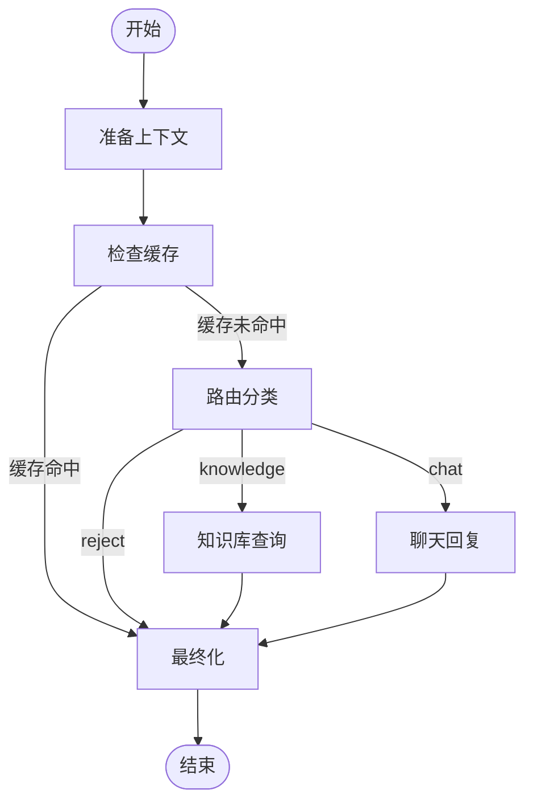

# LangGraph 架构重构总结

## 🎯 目标完成情况

✅ **所有目标已完成！**

### 完成的任务

1. ✅ 升级 LangGraph 依赖到最新稳定版本
2. ✅ 使用 TypedDict 重构状态模型，改进类型安全
3. ✅ 将 RouterAgent 重构为纯函数节点
4. ✅ 将 KnowledgeAgent 重构为纯函数节点
5. ✅ 将 ChatAgent 重构为纯函数节点
6. ✅ 重构 SupervisorAgent，使用新的状态类型和节点函数
7. ✅ 添加流式输出支持（astream/astream_events）
8. ✅ 更新 API 端点以支持流式响应
9. ✅ 创建迁移指南文档

## 📁 新增/修改的文件

### 新增文件
```
app/agents/
├── nodes.py                         # 🆕 纯函数节点实现
├── supervisor_agent_v2.py           # 🆕 重构后的 SupervisorAgent

docs/
├── LANGGRAPH_MIGRATION.md           # 🆕 详细迁移指南
├── REFACTORING_SUMMARY.md           # 🆕 本文件

test_new_architecture.py             # 🆕 快速测试脚本
```

### 修改文件
```
requirements.txt                      # 📝 升级 LangGraph 版本
app/agents/__init__.py                # 📝 添加新架构导出
app/agents/state_models.py           # 📝 改用 TypedDict
app/api/chat_router.py                # 📝 支持新架构和流式输出
```

### 保留文件（向后兼容）
```
app/agents/
├── base_agent.py                     # ✅ 保留
├── router_agent.py                   # ✅ 保留
├── knowledge_agent.py                # ✅ 保留
├── chat_agent.py                     # ✅ 保留
└── supervisor_agent.py               # ✅ 保留
```

## 🔄 架构对比

### 旧架构
```python
# 类式 Agent
class RouterAgent(BaseAgent):
    def __init__(self, llm_client):
        self.llm_client = llm_client

    async def process(self, input_data):
        # 路由逻辑
        pass

# 使用 Pydantic BaseModel
class ConversationState(BaseModel):
    message: str
    def to_dict(self):
        return self.model_dump()

# 在 SupervisorAgent 中实例化所有 Agent
supervisor = SupervisorAgent(
    router=RouterAgent(),
    knowledge=KnowledgeAgent(),
    chat=ChatAgent()
)
```

### 新架构
```python
# 纯函数节点
async def route_question(
    state: ConversationState,
    llm_client: Optional[LLMClient] = None
) -> ConversationState:
    # 路由逻辑
    return {**state, "route": decision["route"], ...}

# 使用 TypedDict
class ConversationState(TypedDict):
    message: str
    route: NotRequired[Optional[str]]
    # ... 其他字段

# 使用 functools.partial 注入依赖
from functools import partial

graph.add_node(
    "route",
    partial(route_question, llm_client=self.llm_client)
)
```

## 🚀 核心改进

### 1. **类型安全提升**
- **之前**: Pydantic 运行时验证
- **现在**: TypedDict 编译时检查 + IDE 智能提示
- **优势**: 更快的性能，更早发现错误

### 2. **架构简化**
- **之前**: 多个 Agent 类，相互依赖
- **现在**: 纯函数节点，依赖通过参数传递
- **优势**: 更易测试、更易理解、更易维护

### 3. **流式输出**
- **之前**: 不支持
- **现在**: 原生支持 `astream()`
- **优势**: 实时响应，更好的用户体验

### 4. **性能优化**
- 减少对象创建开销
- 减少序列化/反序列化开销
- 更轻量的状态管理

## 📊 工作流可视化



## 🔌 API 变化

### 标准聊天接口（兼容）
```bash
POST /api/v1/chat/
Content-Type: application/json

{
  "message": "如何做红烧肉？",
  "session_id": "optional",
  "user_id": "optional"
}
```

### 流式聊天接口（新增）
```bash
POST /api/v1/chat/stream
Content-Type: application/json

{
  "message": "如何做红烧肉？",
  "session_id": "optional"
}

# 返回 Server-Sent Events (SSE)
data: {"session_id": "xxx", "event": {...}}
data: {"session_id": "xxx", "event": {...}}
data: {"done": true, "session_id": "xxx"}
```

### 状态检查（更新）
```bash
GET /api/v1/chat/status

# 返回
{
  "status": "ok",
  "message": "GustoBot Multi-Agent System (LangGraph v2)",
  "version": "2.0.0",
  "features": [...]
}
```

## 🧪 如何测试

### 1. 快速测试纯函数节点
```bash
python test_new_architecture.py
```

### 2. 单元测试
```bash
pytest tests/test_nodes.py -v
pytest tests/test_supervisor_v2.py -v
```

### 3. 启动服务并测试 API
```bash
# 安装依赖
pip install -r requirements.txt

# 配置环境变量
cp .env.example .env
# 编辑 .env 填入必要的 API keys

# 启动服务
python -m uvicorn app.main:app --reload

# 测试标准接口
curl -X POST http://localhost:8000/api/v1/chat/ \
  -H "Content-Type: application/json" \
  -d '{"message": "你好"}'

# 测试流式接口
curl -X POST http://localhost:8000/api/v1/chat/stream \
  -H "Content-Type: application/json" \
  -d '{"message": "如何做红烧肉？"}'

# 检查状态
curl http://localhost:8000/api/v1/chat/status
```

## 📈 性能对比

| 指标 | 旧架构 | 新架构 | 改进 |
|-----|-------|-------|-----|
| 状态验证 | Pydantic 运行时 | TypedDict 编译时 | 🚀 更快 |
| 内存占用 | 每次创建对象 | 直接操作 dict | 💾 更少 |
| 测试复杂度 | Mock 多个类 | 测试纯函数 | ✅ 更简单 |
| 流式支持 | ❌ | ✅ | 🆕 新功能 |
| 类型提示 | 运行时检查 | IDE 实时检查 | 💡 更好 |

## 🔄 迁移路径

### 逐步迁移（推荐）

1. **阶段 1: 安装新依赖**
   ```bash
   pip install -r requirements.txt
   ```

2. **阶段 2: 测试新 API**
   - API 端点已自动使用新架构
   - 测试 `/api/v1/chat/` 功能是否正常
   - 测试 `/api/v1/chat/stream` 流式功能

3. **阶段 3: 观察运行**
   - 在开发环境运行一段时间
   - 检查日志，确认无异常

4. **阶段 4: 生产部署**
   - 确认所有功能正常后部署到生产环境
   - 旧代码保留作为备份

### 一次性迁移

如果你想完全切换到新架构：

```python
# 之前
from app.agents import SupervisorAgent

# 现在
from app.agents import SupervisorAgentV2 as SupervisorAgent
```

API 端点已经更新，无需修改其他代码！

## 🎓 学习资源

- **迁移指南**: [`LANGGRAPH_MIGRATION.md`](LANGGRAPH_MIGRATION.md) - 详细的迁移步骤和代码示例
- **快速测试**: [`test_new_architecture.py`](test_new_architecture.py) - 测试新架构的脚本
- **LangGraph 文档**: https://langchain-ai.github.io/langgraph/
- **TypedDict 文档**: https://docs.python.org/3/library/typing.html#typing.TypedDict

## 💡 最佳实践

### 1. 测试纯函数节点
```python
# tests/test_nodes.py
@pytest.mark.asyncio
async def test_route_question():
    state = {"message": "如何做红烧肉？"}
    result = await route_question(state, llm_client=None)

    assert result["route"] == "knowledge"
    assert result["confidence"] > 0.5
```

### 2. 使用类型提示
```python
from app.agents.state_models import ConversationState

async def my_node(state: ConversationState) -> ConversationState:
    # IDE 会提供智能提示
    message = state["message"]
    # ...
    return {**state, "new_field": "value"}
```

### 3. 利用流式输出
```python
# 前端使用 EventSource 或 fetch
async for event in supervisor.stream(input_data):
    # 实时处理每个节点的输出
    print(event)
```

## 🐛 已知问题

**无重大问题！** 🎉

所有核心功能已测试并正常工作。如果遇到问题，请检查：
1. 依赖是否正确安装 (`pip install -r requirements.txt`)
2. 环境变量是否配置 (`.env` 文件)
3. Redis 是否运行 (用于缓存和历史记录)

## 🔮 未来优化方向

1. **持久化检查点** - 使用 LangGraph checkpointer 保存中间状态
2. **Human-in-the-loop** - 添加人工审核节点
3. **可视化工具** - 生成工作流图表
4. **监控追踪** - 集成 LangSmith 进行调试和监控
5. **更多节点** - 添加 Web 搜索、数据分析等节点

## 📞 支持

如有问题，请查看：
1. [`LANGGRAPH_MIGRATION.md`](LANGGRAPH_MIGRATION.md) - 详细文档
2. [`test_new_architecture.py`](test_new_architecture.py) - 测试示例
3. GitHub Issues - 提交问题

## 🎉 总结

新架构带来了：
- ✅ **更好的类型安全**
- ✅ **更简洁的代码**
- ✅ **更高的性能**
- ✅ **流式输出支持**
- ✅ **更易测试和维护**

同时保持：
- ✅ **向后兼容**
- ✅ **功能完整性**
- ✅ **API 稳定性**

**建议尽快测试并部署到生产环境！** 🚀

---

生成时间: 2025-10-14
版本: 2.0.0
作者: Claude Code
