# Agent 路由决策流程图

可视化展示 GustoBot 多 Agent 系统的路由决策和智能子决策流程

---

## 总体架构流程

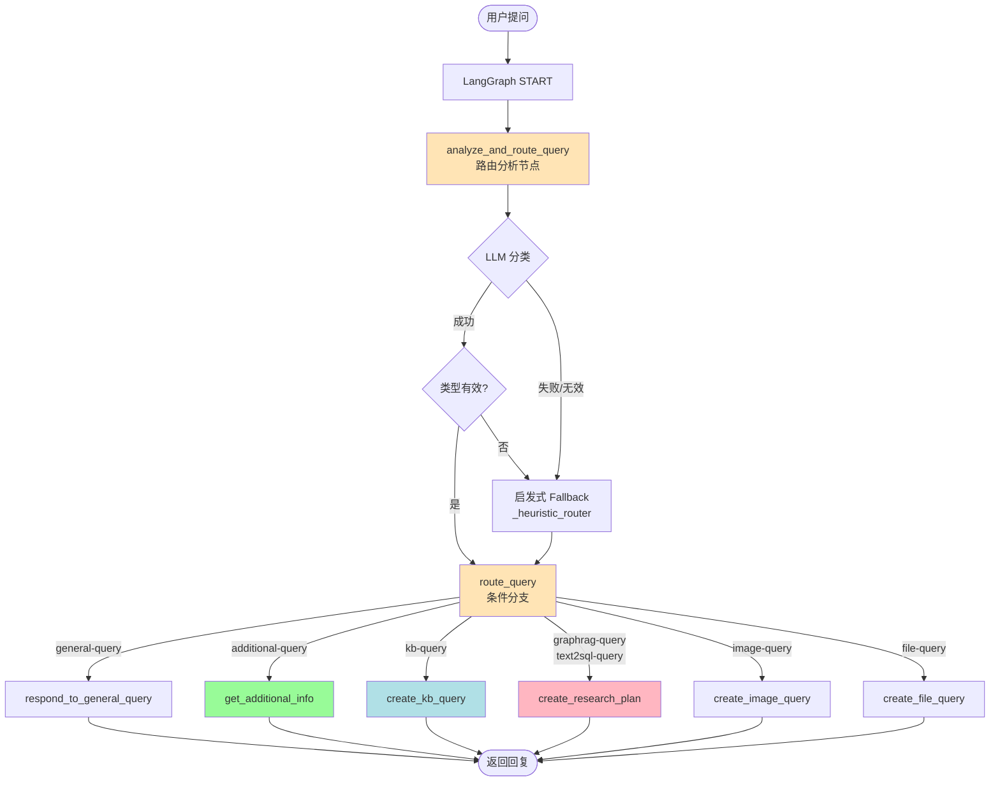

---

## 详细决策流程

### 1. 路由分析节点（analyze_and_route_query）

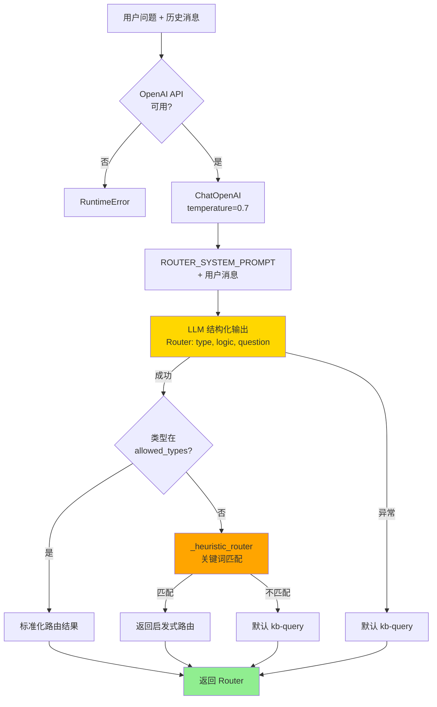

**Allowed Types**:
- `general-query`
- `additional-query`
- `kb-query`
- `graphrag-query`
- `image-query`
- `file-query`
- `text2sql-query`

**启发式关键词**:
- **GraphRAG**: "怎么做"、"如何做"、"做法"、"步骤"、"火候"、"食材"、"原料"、"需要什么"、"配料"、"用什么"
- **Text2SQL**: "统计"、"多少"、"总数"、"数量"、"排名"

---

### 2. 条件分支（route_query）

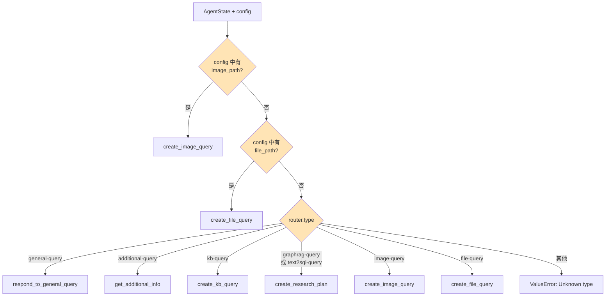

---

### 3. General-Query 流程

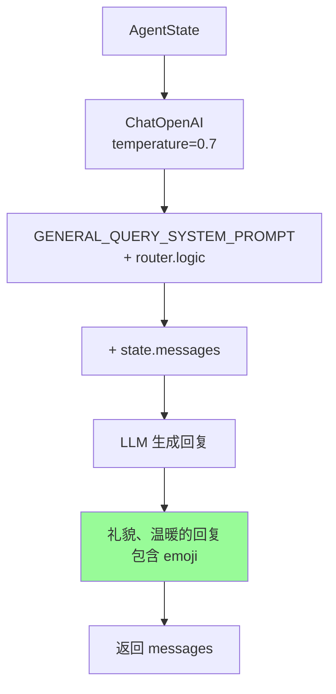

**特点**:
- ✅ 无需任何数据库查询
- ✅ 直接 LLM 生成
- ✅ 使用"亲～"、"厨友您好～"
- ✅ 适当 emoji

---

### 4. Additional-Query 流程（含 Guardrails）

```mermaid
graph TD
    Input[AgentState] --> Neo4j{Neo4j<br/>连接成功?}
    Neo4j -->|否| NoGraph[neo4j_graph = None]
    Neo4j -->|是| Graph[获取 Graph Schema]

    NoGraph --> Scope[加载服务范围描述]
    Graph --> Scope

    Scope --> GuardrailPrompt[GUARDRAILS_SYSTEM_PROMPT<br/>+ scope_description<br/>+ graph_context]
    GuardrailPrompt --> GuardrailLLM[LLM 结构化输出<br/>AdditionalGuardrailsOutput]

    GuardrailLLM --> Decision{decision}

    Decision -->|end| Reject[礼貌拒绝<br/>"不太属于菜谱范围"]
    Decision -->|proceed| InfoPrompt[GET_ADDITIONAL_SYSTEM_PROMPT<br/>+ router.logic]

    InfoPrompt --> AskLLM[LLM 生成补充询问]
    AskLLM --> AskOutput[友好询问用户]

    Reject --> Output[返回 messages]
    AskOutput --> Output

    style Decision fill:#FFD700
    style Reject fill:#FF6B6B
    style AskOutput fill:#98FB98
```

**Guardrails 判断逻辑**:

| 问题 | 决策 | 原因 |
|-----|------|------|
| "我想做菜" | `proceed` | 菜谱相关但信息不足 |
| "这个菜怎么做好吃" | `proceed` | 菜谱相关但缺菜名 |
| "今天天气怎么样" | `end` | 与菜谱无关 |
| "我肚子疼吃什么药" | `end` | 医疗诊断（边界） |

---

### 5. KB-Query 流程（向量知识库多工具）

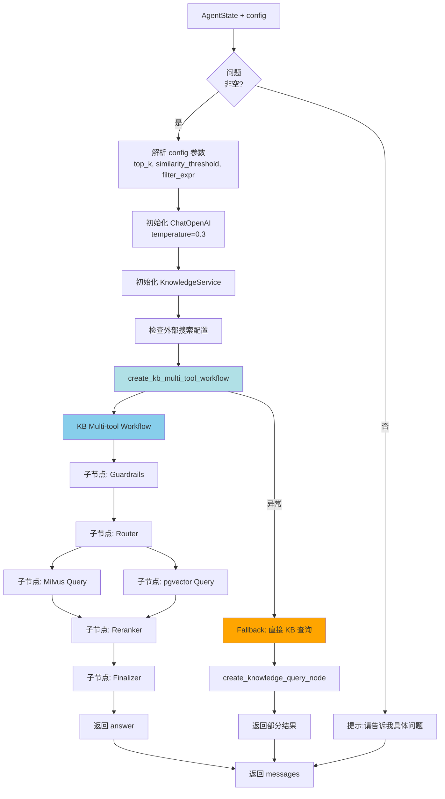

#### KB Multi-tool Workflow 子流程

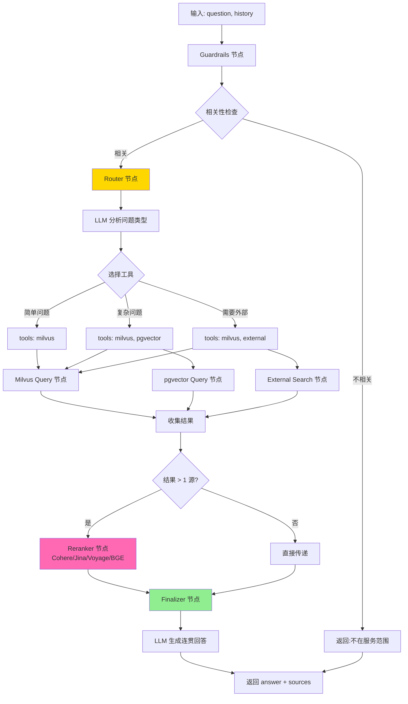

**工具选择逻辑**（Router 节点内部）:

| 问题特征 | 选择工具 | 理由 |
|---------|---------|------|
| 简单历史查询 | `[milvus]` | 单一来源足够 |
| 复杂文化背景 | `[milvus, pgvector]` | 多源融合提高准确性 |
| 罕见问题 | `[milvus, external]` | 需要外部搜索补充 |
| 高优先级 | `[milvus, pgvector, external]` | 全面检索 |

**Reranker 流程**:
1. 合并所有来源结果（如 Milvus 5条 + pgvector 3条 = 8条）
2. 调用 Reranker API（Cohere/Jina/Voyage/BGE）
3. 重新排序并返回 top_k（如5条）
4. 传递给 Finalizer

---

### 6. GraphRAG-Query 流程（图谱多工具）

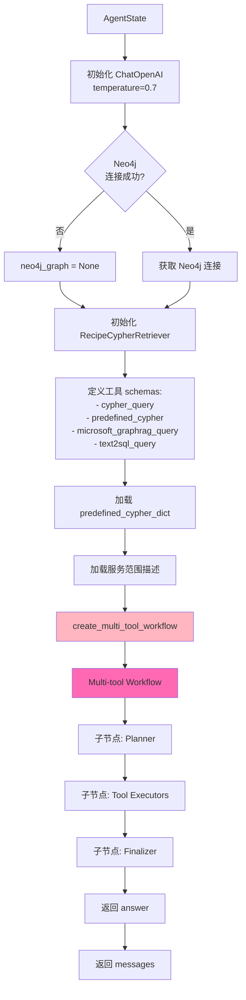

#### Multi-tool Workflow 子流程（核心智能决策）

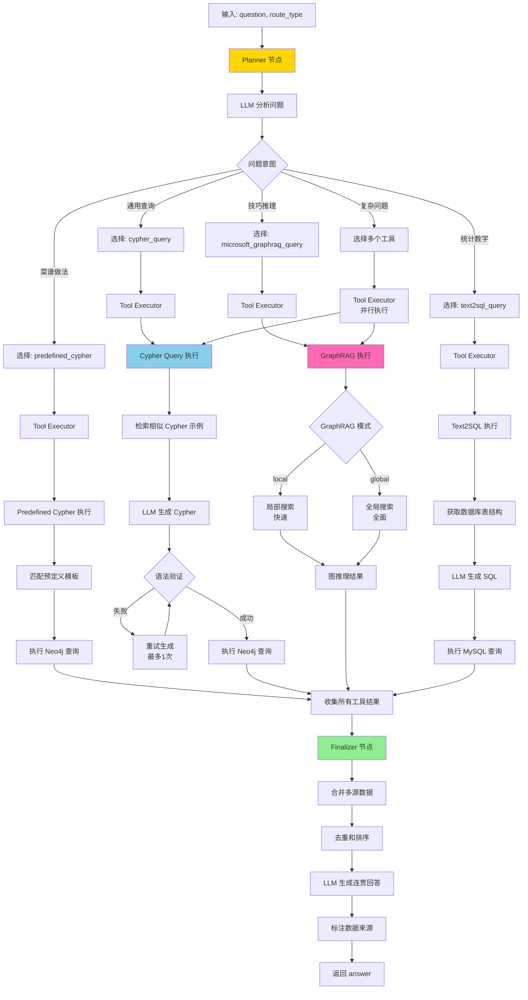

**Planner 工具选择逻辑**:

| 问题示例 | 选择工具 | 原因 |
|---------|---------|------|
| "红烧肉怎么做" | `[predefined_cypher]` | 高频场景，有预定义模板 |
| "什么菜含牛肉" | `[cypher_query]` | 通用查询，动态生成 |
| "怎么判断鱼熟了" | `[microsoft_graphrag_query]` | 需要推理经验 |
| "数据库有多少道菜" | `[text2sql_query]` | 统计查询 |
| "炒青菜怎么保持翠绿" | `[cypher_query, microsoft_graphrag_query]` | 方法 + 技巧 |
| "为什么红烧肉发柴" | `[cypher_query, microsoft_graphrag_query]` | 正确做法 + 原因推理 |
| "什么菜适合感冒吃" | `[cypher_query, microsoft_graphrag_query]` | 图谱关系 + 食疗推理 |
| "麻辣口味的菜有多少" | `[cypher_query, text2sql_query]` | 图谱查询 + 统计 |

**Cypher 生成和验证**:

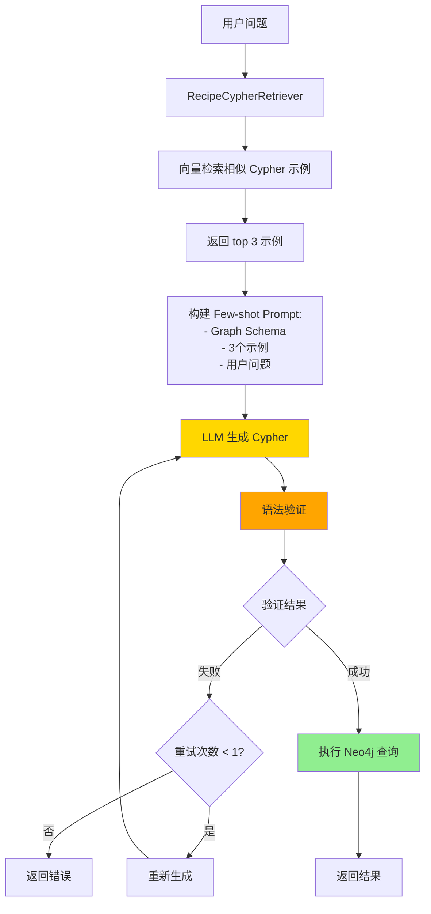

**GraphRAG 模式选择**:

| 问题类型 | 模式 | 理由 |
|---------|------|------|
| 单个菜谱相关 | `local` | 局部搜索快速 |
| 菜系比较 | `global` | 需要全局视角 |
| 食疗推荐 | `global` | 跨多个实体 |
| 技巧查询 | `local` | 聚焦单一主题 |

---

### 7. Image-Query 流程

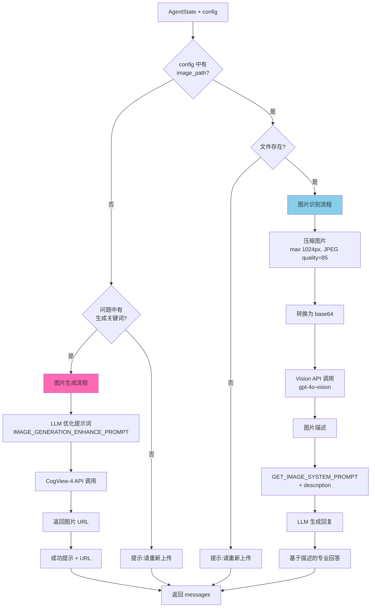

**生成关键词**: "生成"、"画"、"创建"、"制作图片"、"做一张"、"给我一张"、"来一张"

---

### 8. File-Query 流程

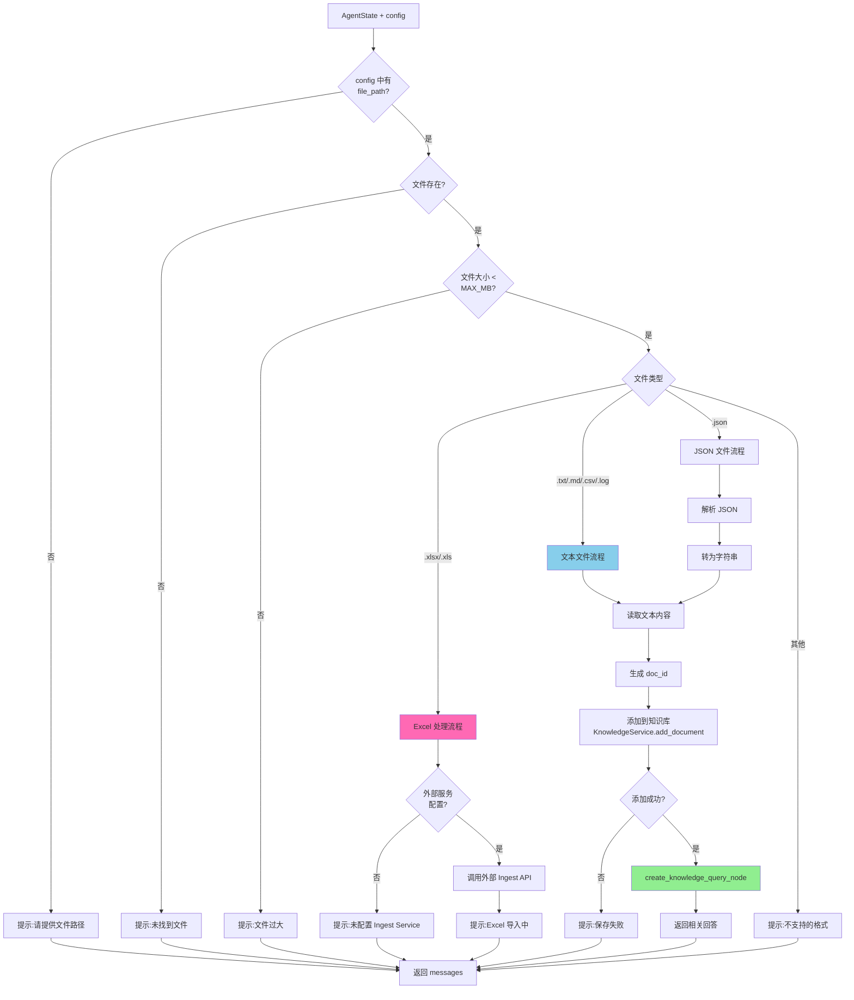

**支持的文件类型**:
- 文本: `.txt`, `.md`, `.csv`, `.log`
- JSON: `.json`
- Excel: `.xlsx`, `.xls`（需要外部 Ingest Service）

---

## 关键决策点总结

### 🎯 决策点1: 路由分类（LLM + 启发式）

| 层级 | 方法 | 输入 | 输出 |
|-----|------|------|------|
| 第1层 | LLM 分类 | 问题 + ROUTER_SYSTEM_PROMPT | Router(type, logic, question) |
| 第2层 | 启发式关键词 | 问题文本 | 匹配的路由类型 |
| 第3层 | 默认 Fallback | - | kb-query |

### 🎯 决策点2: Guardrails（Additional-Query）

| 输入 | 决策 | 输出 |
|-----|------|------|
| 菜谱相关但信息不足 | `proceed` | 询问补充信息 |
| 与菜谱无关 | `end` | 礼貌拒绝 |

### 🎯 决策点3: KB Multi-tool Router

| 问题特征 | 工具选择 | 后续处理 |
|---------|---------|---------|
| 简单查询 | `[milvus]` | 直接返回 |
| 复杂查询 | `[milvus, pgvector]` | Reranker 融合 |
| 罕见问题 | `[milvus, external]` | 外部搜索补充 |

### 🎯 决策点4: GraphRAG Planner

| 问题意图 | 工具选择 | 数据来源 |
|---------|---------|---------|
| 高频做法 | `[predefined_cypher]` | Neo4j (预定义模板) |
| 通用查询 | `[cypher_query]` | Neo4j (LLM 生成) |
| 推理技巧 | `[microsoft_graphrag_query]` | LightRAG 图推理 |
| 统计数字 | `[text2sql_query]` | MySQL |
| 复杂问题 | 多个工具组合 | 多源融合 |

### 🎯 决策点5: Cypher 生成方式

| 场景 | 方式 | 优势 |
|-----|------|------|
| 高频场景 | Predefined Cypher | 快速、准确 |
| 通用查询 | LLM 动态生成 + Few-shot | 灵活、覆盖广 |
| 语法验证失败 | 重试1次 | 容错性 |

### 🎯 决策点6: GraphRAG 模式

| 问题范围 | 模式 | 特点 |
|---------|------|------|
| 局部问题 | `local` | 快速、聚焦 |
| 全局问题 | `global` | 全面、深度 |

### 🎯 决策点7: Reranker 触发

| 条件 | 是否触发 |
|-----|---------|
| 结果来自单一来源 | ❌ 不触发 |
| 结果来自多个来源 | ✅ 触发 |

### 🎯 决策点8: Finalizer 融合

| 输入 | 处理 | 输出 |
|-----|------|------|
| 单一工具结果 | 直接格式化 | 结构化回答 |
| 多个工具结果 | 合并 + 去重 + LLM 融合 | 连贯回答 + 来源标注 |

---

## 使用说明

1. **阅读顺序**:
   - 先看"总体架构流程"了解全局
   - 再看"详细决策流程"理解每个路由
   - 最后看"关键决策点总结"掌握核心逻辑

2. **测试时对照**:
   - 运行测试脚本时，对照流程图观察日志
   - 验证实际执行路径是否与预期一致

3. **问题排查**:
   - 路由错误 → 检查"决策点1"
   - 拒答问题 → 检查"决策点2"
   - 检索质量差 → 检查"决策点3"
   - 工具选择不当 → 检查"决策点4"

4. **优化方向**:
   - 提高路由准确性 → 优化 ROUTER_SYSTEM_PROMPT
   - 提高检索质量 → 调整 Reranker 配置
   - 提高推理能力 → 优化 Planner prompt
   - 提高回答质量 → 优化 Finalizer prompt

---

**配套文档**:
- 测试问题集: `tests/test_agent_routing_questions.md`
- 测试指南: `docs/agent_routing_test_guide.md`
- 快速参考: `docs/agent_routing_quick_reference.md`
